---
## Front matter
title: "Лабораторная работа №3 по предмету Операционные системы"
subtitle: "Группа НПМбв-02-19"
author: "Нечаева Виктория Алексеевна"

## Generic otions
lang: ru-RU
toc-title: "Содержание"

## Bibliography
bibliography: bib/cite.bib
csl: pandoc/csl/gost-r-7-0-5-2008-numeric.csl

## Pdf output format
toc: true # Table of contents
toc-depth: 2
lof: true # List of figures
lot: true # List of tables
fontsize: 12pt
linestretch: 1.5
papersize: a4
documentclass: scrreprt
## I18n polyglossia
polyglossia-lang:
  name: russian
polyglossia-otherlangs:
  name: english
## I18n babel
babel-lang: russian
babel-otherlangs: english
## Fonts
mainfont: PT Serif
romanfont: PT Serif
sansfont: PT Sans
monofont: PT Mono
mainfontoptions: Ligatures=TeX
romanfontoptions: Ligatures=TeX
sansfontoptions: Ligatures=TeX,Scale=MatchLowercase
monofontoptions: Scale=MatchLowercase,Scale=0.9
## Biblatex
biblatex: true
biblio-style: "gost-numeric"
biblatexoptions:
  - parentracker=true
  - backend=biber
  - hyperref=auto
  - language=auto
  - autolang=other*
  - citestyle=gost-numeric
## Pandoc-crossref LaTeX customization
figureTitle: "Рис."
tableTitle: "Таблица"
listingTitle: "Листинг"
lofTitle: "Список иллюстраций"
lotTitle: "Список таблиц"
lolTitle: "Листинги"
## Misc options
indent: true
header-includes:
  - \usepackage{indentfirst}
  - \usepackage{float} # keep figures where there are in the text
  - \floatplacement{figure}{H} # keep figures where there are in the text
---

# Цель работы

Целью данной работы является изучение идеологии и методов применения средств контроля версий и освоения умения по работе с git.

# Задание

– Создать базовую конфигурацию для работы с git.

– Создать ключ SSH.

– Создать ключ PGP.

– Настроить подписи git.

– Зарегистрироваться на Github.

– Создать локальный каталог для выполнения заданий по предмету.

Лабораторная работа выполняется в Ubuntu.

# Выполнение лабораторной работы
## Настройка github
1. Создайте учётную запись на https://github.com.
2. Заполните основные данные на https://github.com.
На (рис. 1) учетная запись уже после выполнения этой лабораторной работы. Репозитория два, так как аккаунт создан давно и есть один приватный репозиторий.

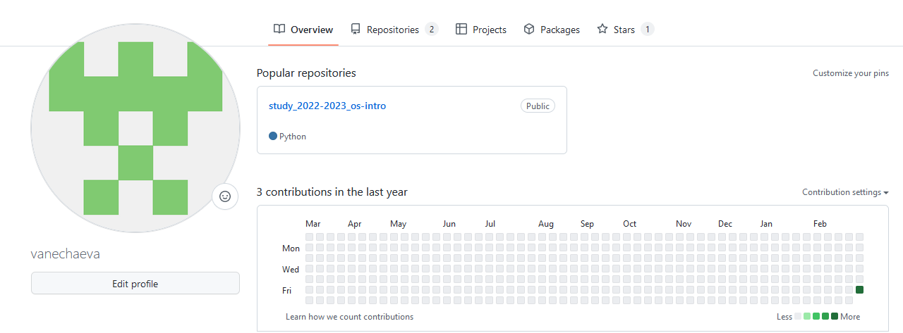{#fig:001 width=100%}

## Установка программного обеспечения

Установка git-flow в Ubuntu (рис. 2)

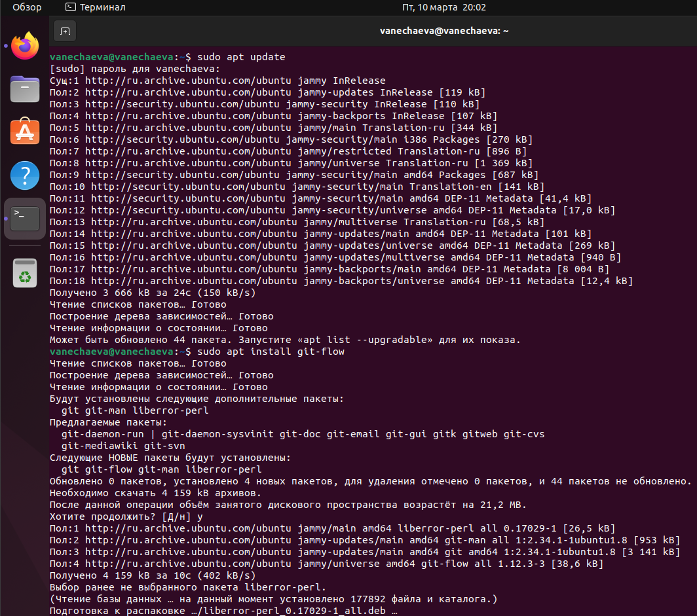{#fig:002 width=100%}

Установка gh в Ubuntu (рис.3, рис.4)
 
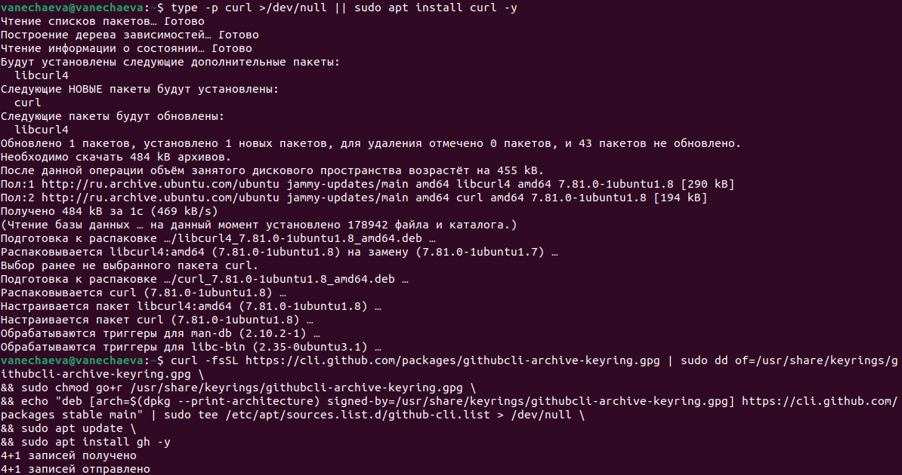{#fig:003 width=100%}
 
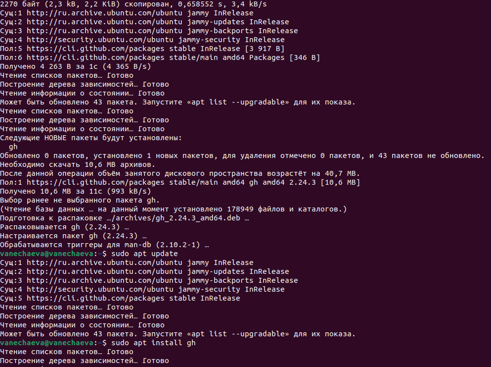{#fig:004 width=100%}

## Базовая настройка git
Рисунок 5.

– Зададим имя и email владельца репозитория:

git config --global user.name "Name Surname"

git config --global user.email "work@mail"

– Настроим utf-8 в выводе сообщений git:
git config --global core.quotepath false

– Настройте верификацию и подписание коммитов git.

– Зададим имя начальной ветки (будем называть её master):
30 Лабораторная работа No 2. Управление версиями

git config --global init.defaultBranch master
– Параметр autocrlf:

git config --global core.autocrlf input
– Параметр safecrlf:

git config --global core.safecrlf warn

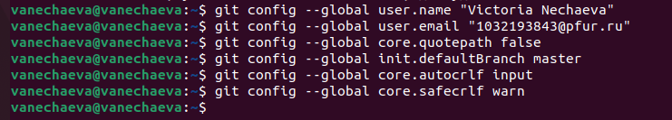{#fig:005 width=100%} 

## Создайте ключи ssh
Рисунок 6.\

– по алгоритму rsa с ключём размером 4096 бит:

ssh-keygen -t rsa -b 4096

– по алгоритму ed25519:

ssh-keygen -t ed25519

 
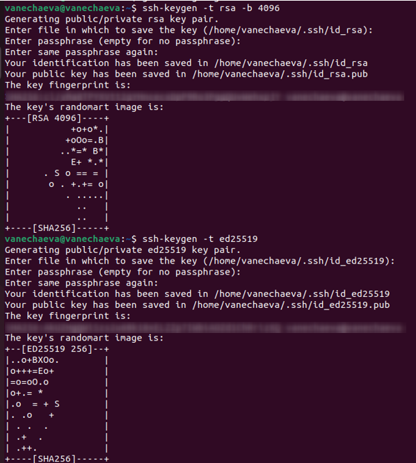{#fig:006 width=80%} 

## Создайте ключи pgp
Рисунки 7 и 8.\
– Генерируем ключ\
gpg --full-generate-key\

Из предложенных опций выбираем:\
– тип RSA and RSA;\
– размер 4096;\
– выберите срок действия; значение по умолчанию — 0 (срок действия не истекает никогда).\

GPG запросит личную информацию, которая сохранится в ключе:\
– Имя (не менее 5 символов).\
– Адрес электронной почты.\
– При вводе email убедитесь, что он соответствует адресу, используемому на GitHub.\
– Комментарий. Можно ввести что угодно или нажать клавишу ввода, чтобы оставить это поле пустым.\

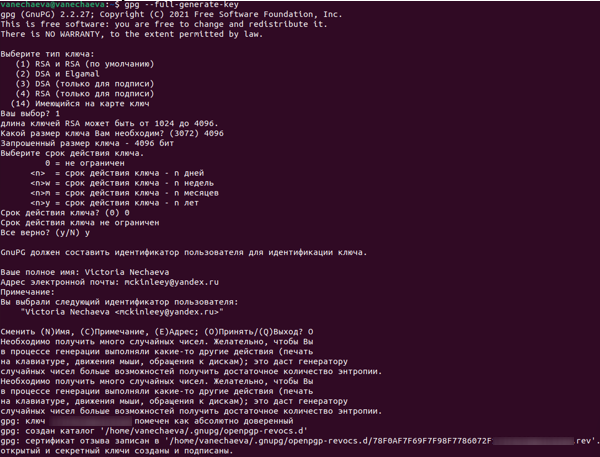{#fig:007 width=100%} 

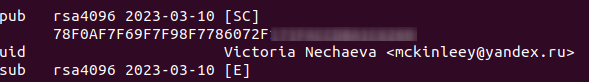{#fig:008 width=100%} 

## Добавление PGP ключа в GitHub
– Выводим список ключей и копируем отпечаток приватного ключа: (рис.9)\
gpg --list-secret-keys --keyid-format LONG
 
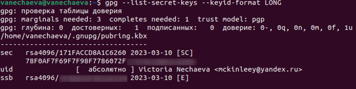{#fig:009 width=100%} 

– Формат строки:\
sec Алгоритм/Отпечаток_ключа Дата_создания [Флаги]\ [Годен_до]ID_ключа

– Cкопируйте ваш сгенерированный PGP ключ в буфер обмена:\
gpg --armor --export <PGP Fingerprint> | xclip -sel clip

Указываю сначала с кавычками-скобочками. Исправляю.\
 
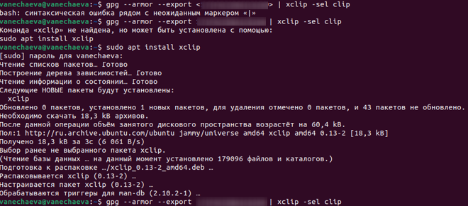{#fig:010 width=100%} 

– Перейдите в настройки GitHub (https://github.com/settings/keys), нажмите на кнопку New GPG key и вставьте полученный ключ в поле ввода. (рис. 11)\
 
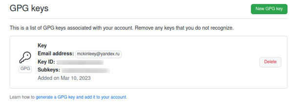{#fig:011 width=100%} 

## Настройка автоматических подписей коммитов git
– Используя введённый email, укажите Git применять его при подписи коммитов (рис. 12):\

git config --global user.signingkey <PGP Fingerprint>\
git config --global commit.gpgsign true\
git config --global gpg.program $(which gpg2)\
 
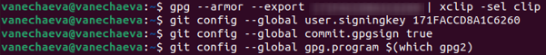{#fig:012 width=100%} 

## Создание репозитория курса на основе шаблона
Шаблон для рабочего пространства\
– Репозиторий: [https://github.com/yamadharma/course-directory-student-template.](https://github.com/yamadharma/course-directory-student-template.)

– Необходимо создать шаблон рабочего пространства.\
– Например, для 2022–2023 учебного года и предмета «Операционные системы» (код предмета os-intro) создание репозитория примет следующий вид: \

mkdir -p ~/work/study/2021-2022/"Операционные системы"\
cd ~/work/study/2021-2022/"Операционные системы"\
gh repo create study_2021-2022_os-intro--template=yamadharmacourse-directory-student-template --public\
git clone --recursive git@github.com:<owner>/study_2021-2022_os-intro.git os-intro\

При создании репозитория нам напоминают, что надо авторизоваться (рис.13). Для этого добавляем SSH ключ (рис.14) в аккаунте гитхаба, через gh auth login авторизовываемся:\
Выбираем github.com, SSH, Skip, Paste an authentication token (формируем в гх), вставляем его в консоли. (рис. 15) Завершаем создание и клонирование репозитория (рис.16)

 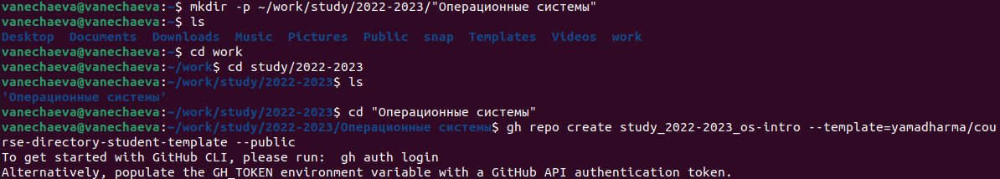{#fig:013 width=100%} 

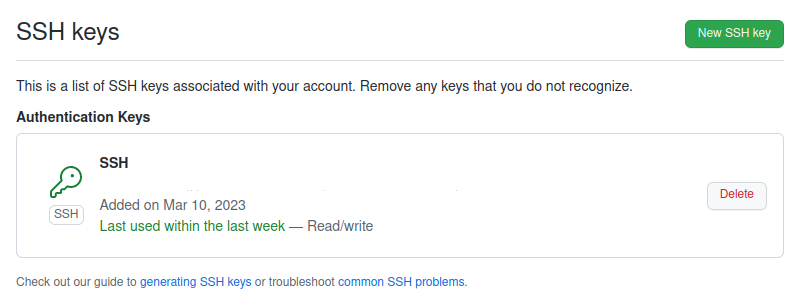{#fig:014 width=100%} 
 
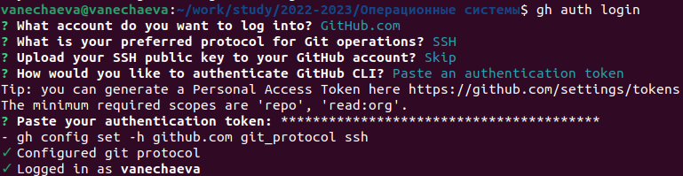{#fig:015 width=100%} 

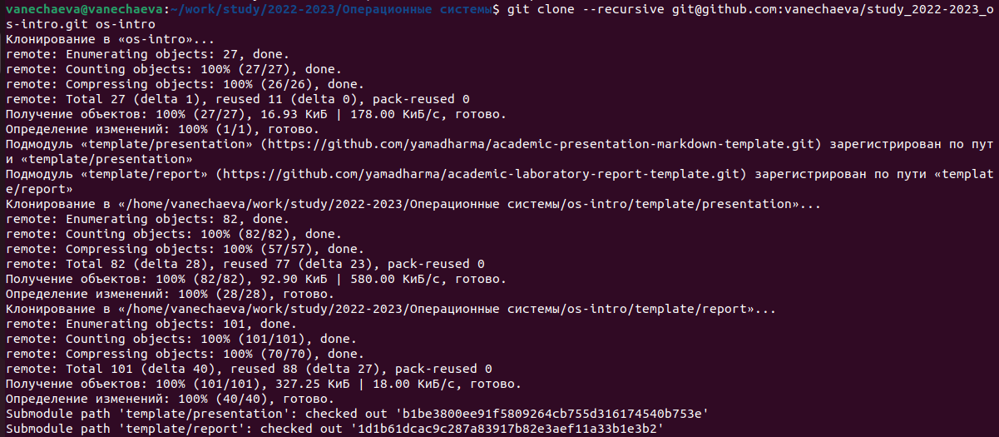{#fig:016 width=100%} 

## Настройка каталога курса
Рисунок 17.\
– Перейдите в каталог курса:\
cd ~/work/study/2021-2022/"Операционные системы"/os-intro\

– Удалите лишние файлы:\
rm package.json\

– Создайте необходимые каталоги:\
Лабораторная работа No 2. Управление версиями\
make COURSE=os-intro\

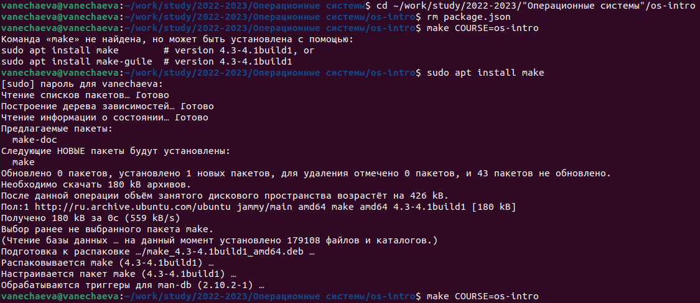{#fig:017 width=100%} 

– Отправьте файлы на сервер (рис. 16, рис.17):\
git add .\
git commit -am 'feat(main): make course structure'\
git push\
 
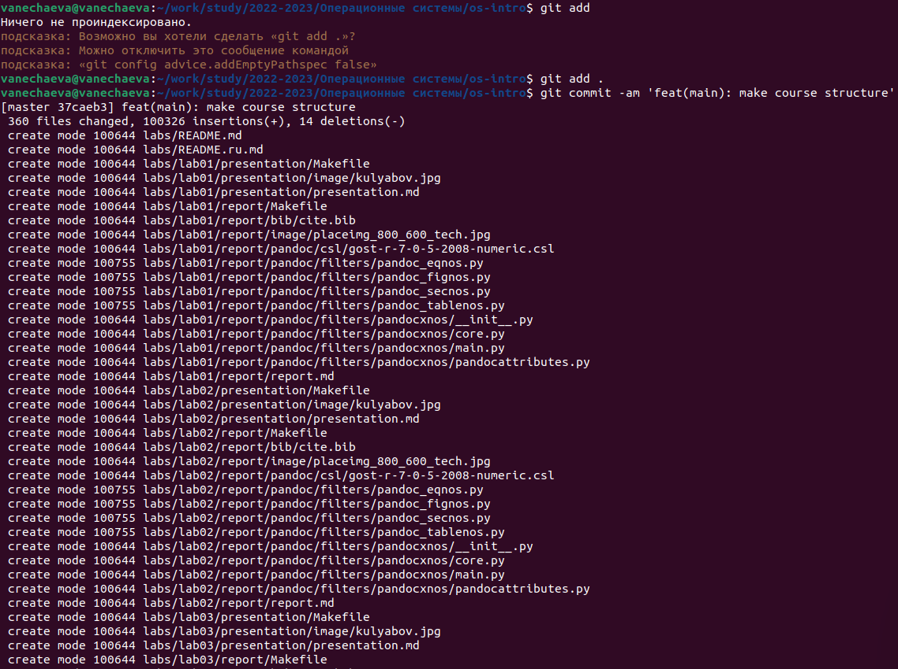{#fig:018 width=100%} 

 
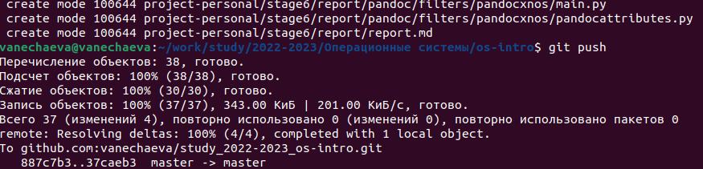{#fig:019 width=100%} 

# Выводы

По итогу выполнения лабораторной работы удалось познакомиться с идеологией и инструментами системы управления версиями git.\

# Контрольные вопросы
1) **Что такое системы контроля версий (VCS) и для решения каких задач они предназначаются?**\
VCS — это практика отслеживания изменений программного кода и управления им. Системы контроля версий — это программные инструменты, помогающие командам разработчиков управлять изменениями в исходном коде с течением времени. В свете усложнения сред разработки они помогают командам разработчиков работать быстрее и эффективнее.

2) **Объясните следующие понятия VCS и их отношения: хранилище, commit, история, рабочая копия.**\
Хранилище версий – или репозиторий - в нем хранятся все документы вместе с историей их изменения и другой служебной информацией.
commit делает для проекта снимок текущего состояния изменений, добавленных в раздел проиндексированных файлов. Такие подтвержденные снимки состояния можно рассматривать как «безопасные» версии проекта — VCS не будет их менять, пока вы явным образом не попросите об этом.\
log или история перечисляет коммиты, сделанные в репозитории в обратном к хронологическому порядке — последние коммиты находятся вверху. Тут же можно увидеть различие одного коммита от другого\
Рабочая копия является снимком одной версии проекта. Эти файлы извлекаются из сжатой базы данных в каталоге Git и помещаются на диск, для того чтобы их можно было использовать или редактировать\
Отношения: правки вносятся в рабочую копию, делаете коммит. Коммиты хранятся в репозиториях, log (история) позволяет посмотреть историю коммитов в репо.\

3) **Что представляют собой и чем отличаются централизованные и децентрализованные VCS? Приведите примеры VCS каждого вида.**\
Централизованные системы контроля версий представляют собой приложения типа клиент-сервер, когда репозиторий проекта существует в единственном экземпляре и хранится на сервере. Доступ к нему осуществлялся через специальное клиентское приложение. Примеры - CVS, Subversion.\
Децентрализованные VCS позволяют хранить репозиторий у каждого разработчика, работающего с данной системой. При этом можно выделить центральный репозиторий (условно), в который будут отправляться изменения из локальных и, с ним же эти локальные репозитории будут синхронизироваться. При работе с такой системой, пользователи периодически синхронизируют свои локальные репозитории с центральным и работают непосредственно со своей локальной копией. Примеры – Git, Mercurial.\

4) **Опишите действия с VCS при единоличной работе с хранилищем.**\
    Установить и настроить VCS клиента. Создать репозиторий. Это можно сделать с помощью команды "git init" (если используется Git)\
    Добавить файлы в репозиторий. Это можно сделать с помощью команды "git add" \
    Создать коммит. Коммит можно создать с помощью команды "git commit" (или аналогичной команды в другой VCS).\
    Просматривать историю коммитов. Это можно сделать с помощью команды "git log" \
    Восстановить предыдущую версию проекта. Это можно сделать с помощью команды "git checkout".\
    Создавать и удалять ветки (branch).\

5) **Опишите порядок работы с общим хранилищем VCS.**\
    Получение копии проекта из общего хранилища. Для этого нужно выполнить команду "git clone" (если используется Git).\
    Создание новой ветки. Если вы планируете внести изменения в проект, то для этого необходимо создать новую ветку (branch) в вашем локальном репозитории\
    Внесение изменений. Коммит изменений. После внесения изменений в файлы проекта, необходимо выполнить команду "git commit"\
    Отправка изменений на сервер. Для этого выполните команду "git push"\
    Обновление локальной копии проекта. Для этого выполните команду "git pull”\

6) **Каковы основные задачи, решаемые инструментальным средством git?**\
•	Возврат к любой версии кода из прошлого.\
•	Просмотр истории изменений.\
•	Совместная работа без боязни потерять данные или затереть чужую работу.\
7) **Назовите и дайте краткую характеристику командам git.**\
Описано в вопросах 4, 5.

8) **Приведите примеры использования при работе с локальным и удалённым репозиториями.**\
*Локально:*\
Создание локального репозитория. "git init" в терминале.
Добавление файлов в репозиторий. После создания репозитория вы можете добавить файлы проекта в него, используя команду "git add <filename>".\
Создание коммита. После добавления файлов вы можете создать коммит, используя команду "git commit -m 'Commit message'".
Просмотр истории коммитов. Вы можете просмотреть историю коммитов, используя команду "git log".\
Восстановление предыдущей версии. Если в проекте была допущена ошибка или нужно вернуться к предыдущей версии проекта, это можно сделать с помощью команды "git checkout <commit hash>".\
*Удаленно:*
Клонирование удаленного репозитория. Чтобы получить локальную копию проекта, вы можете клонировать репозиторий с помощью команды "git clone <remote repository URL>".\
Добавление изменений в локальный репозиторий. После того, как вы получили копию проекта, вы можете вносить изменения и добавлять их в локальный репозиторий с помощью команд "git add <filename>" и "git commit -m 'Commit message'".\
Отправка изменений в удаленный репозиторий. После добавления изменений в локальный репозиторий вы можете отправить их в удаленный репозиторий, используя команду "git push".
Получение изменений из удаленного репозитория. Если в удаленном репозитории были внесены изменения, вы можете получить их и обновить свою локальную копию проекта, используя команду "git pull".\
Восстановление предыдущей версии. Если в проекте была допущена ошибка или нужно вернуться к предыдущей версии проекта, это можно сделать с помощью команды "git checkout <commit hash>" в локальном репозитории. Если нужно откатить изменения в удаленном репозитории, можно использовать команду "git revert

9) **Что такое и зачем могут быть нужны ветви (branches)?**\
Ветви нужны для того, чтобы разделять код. Например одна ветка у нас может быть основная для разработки. Если мы делаем новый функционал, то мы создаем новую ветку под него, а после окончания работы сливаем то, что мы сделали в основную ветку. Это дает нам возможность легко откатывать код, если вдруг мы передумаем его сливать в основную ветку, либо делать несколько различных изменений в разных ветках.

10) **Как и зачем можно игнорировать некоторые файлы при commit?**\
Игнорируемые файлы — это, как правило, артефакты сборки и файлы, генерируемые машиной из исходных файлов в вашем репозитории, либо файлы, которые по какой-либо иной причине не должны попадать в коммиты.\
Игнорируемые файлы отслеживаются в специальном файле .gitignore, который регистрируется в корневом каталоге репозитория. В Git нет специальной команды для указания игнорируемых файлов: вместо этого необходимо вручную отредактировать файл .gitignore, чтобы указать в нем новые файлы, которые должны быть проигнорированы.\ Файлы .gitignore содержат шаблоны, которые сопоставляются с именами файлов в репозитории для определения необходимости игнорировать эти файлы.
