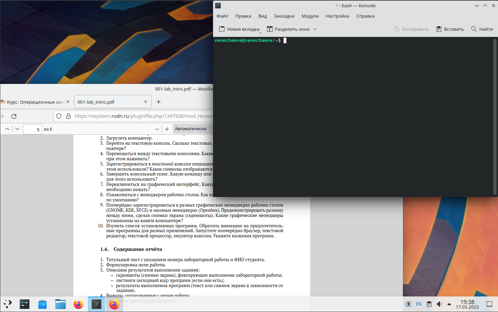

---
## Front matter
title: "Лабораторная работа №4 по предмету Операционные системы"
subtitle: "Группа НПМбв-02-19"
author: "Нечаева Виктория Алексеевна"

## Generic otions
lang: ru-RU
toc-title: "Содержание"

## Bibliography
bibliography: bib/cite.bib
csl: pandoc/csl/gost-r-7-0-5-2008-numeric.csl

## Pdf output format
toc: true # Table of contents
toc-depth: 2
lof: true # List of figures
lot: true # List of tables
fontsize: 12pt
linestretch: 1.5
papersize: a4
documentclass: scrreprt
## I18n polyglossia
polyglossia-lang:
  name: russian
polyglossia-otherlangs:
  name: english
## I18n babel
babel-lang: russian
babel-otherlangs: english
## Fonts
mainfont: PT Serif
romanfont: PT Serif
sansfont: PT Sans
monofont: PT Mono
mainfontoptions: Ligatures=TeX
romanfontoptions: Ligatures=TeX
sansfontoptions: Ligatures=TeX,Scale=MatchLowercase
monofontoptions: Scale=MatchLowercase,Scale=0.9
## Biblatex
biblatex: true
biblio-style: "gost-numeric"
biblatexoptions:
  - parentracker=true
  - backend=biber
  - hyperref=auto
  - language=auto
  - autolang=other*
  - citestyle=gost-numeric
## Pandoc-crossref LaTeX customization
figureTitle: "Рис."
tableTitle: "Таблица"
listingTitle: "Листинг"
lofTitle: "Список иллюстраций"
lotTitle: "Список таблиц"
lolTitle: "Листинги"
## Misc options
indent: true
header-includes:
  - \usepackage{indentfirst}
  - \usepackage{float} # keep figures where there are in the text
  - \floatplacement{figure}{H} # keep figures where there are in the text
---

# Цель работы

Познакомиться с операционной системой Linux, получить практические навыки работы с консолью и некоторыми графическими менеджерами рабочих столов операционной системы.

# Задание

1. Ознакомиться с теоретическим материалом.
2. Загрузить компьютер.
3. Перейти на текстовую консоль. Сколько текстовых консолей доступно на вашем компьютере?
4. Перемещаться между текстовыми консолями. Какие комбинации клавиш необходимо при этом нажимать?
5. Зарегистрироваться в текстовой консоли операционной системы. Какой логин вы при этом использовали? Какие символы отображаются при вводе пароля?
6. Завершить консольный сеанс. Какую команду или комбинацию клавиш необходимо для этого использовать?
7. Переключиться на графический интерфейс. Какую комбинацию клавиш для этого необходимо нажать?
8. Ознакомиться с менеджером рабочих столов. Как называется менеджер, запускаемый по умолчанию?
9. Поочерёдно зарегистрироваться в разных графических менеджерах рабочих столов (GNOME, KDE, XFCE) и оконных менеджерах (Openbox). Продемонстрировать разницу между ними, сделав снимки экрана (скриншоты). Какие графические менеджеры установлены на вашем компьютере?
10. Изучить список установленных программ. Обратить внимание на предпочтительные программы для разных применений. Запустите поочерёдно браузер, текстовой редактор, текстовой процессор, эмулятор консоли. Укажите названия программ.

# Выполнение лабораторной работы
Загружаю ОС на виртуальной машине. У меня это Ubuntu 22.04 на VirtualBox.

## Текстовая консоль
Перехожу на текстовую консоль. Всего их по умолчанию шесть, виртуальные консоли вызываются на ноутбуке с помощью клавиатурных сочетаний Ctrl + Alt + Fn + (F1 - F6), соответственно можно вызвать шесть текстовых консолей от tty1 до tty6. 

У меня на tty1 открывается gdm -- дисплей-менеджер.

На tty2 находится активный сейчас сеанс в выбранной  в дисплей-менеджере графической оболочке.

Следовательно воспользоваться текстовыми консолями я могу на консолях tty3--tty6 (рис. 1, рис. 2, рис. 3, рис. 4):


Регистрируюсь (рис. 5) в текстовой консоли. Мой root-пользователь имеет такой же логин, как и обычный пользователь -- vanechaeva. При вводе пароля в текстовой консоли не отображаются символы, симолы при вводе пароля видны только при авторизации в графическом интерфейсе.


Для завершения сеанса в текстовой консоли можно нажать сочетание Ctrl+D или написать команду logout -- в обоих случаях выкинет к началу авторизации в текущей виртуальной консоли. Чтобы вернуться назад в запущенный сеанс ОС с графикой нужно открыть tty2 (Ctrl + Alt + Fn + F2).

## Графический интерфейс
Как было уже сказано, переключение на графику это открытие tty2 (Ctrl + Alt + Fn + F2). 
В Ubuntu по умолчанию дисплей-менеджер gdm. В нем же происходит авторизация пользователя и есть выбор графических менеджеров рабочих столов.

Чтобы открыть дисплей-менеджер (рис. 6), нужно выйти в tty1 (Ctrl + Alt + Fn + F1). 


## Графические менеджеры рабочих столов
Вне скринкаста в довесок к установленному по умолчанию GNOME для лабораторной работы были установлены Xfce, KDE, Openbox, с помощью следующих команд:
```
sudo apt install xfce4
sudo apt install kde-plasma-desktop
sudo apt-get install openbox
```

Во всех графических оболочках запускается одинаковый набор программ -- эмулятор консоли (далее -- консоль), браузер Firefox, текстовый редактор встроенный в Ubuntu / 	KWrite (из KDE), LibreOffice Writer.

При установке некоторых графических оболочек могут добавляться в систему соответствующие программы, как например с KDE. Но исключая это, стандартный набор утилит, которые были установлены в Ubuntu, открываются в любой графической оболочке, включая оконный менеджер Openbox.

### GNOME (Ubuntu)


### Xfce


### KDE





### Openbox


# Выводы

В данной лабораторной работе было подробно изучено взаимодействие с виртуальными консолями ОС и с некоторыми графическими менеджерами, которые можно установить на свою систему.

# Контрольные вопросы
1. Что такое компьютерный терминал? Есть ли, по вашему мнению, у него преимущества перед графическим интерфейсом?\
Компьютерный терминал - это текстовый интерфейс командной строки для взаимодействия с операционной системой. Он позволяет выполнять задачи быстрее и эффективнее, так как не требует использования мыши и графического интерфейса. Однако, он может быть сложен для новичков и не так удобен в использовании, как графический интерфейс.

2. Что такое входное имя пользователя?\
Входное имя пользователя - это уникальное имя, которое используется для входа в систему. Оно может быть назначено пользователем или администратором и должно быть уникальным для каждого пользователя в системе.

3. В каком файле хранятся пароли пользователей? В каком виде они хранятся?\
Пароли пользователей хранятся в файле /etc/passwd. Этот файл доступен только для чтения администратору системы и содержит информацию о каждом пользователе, включая его пароль в зашифрованном виде.

4. Где хранятся настройки пользовательских программ?\
Настройки пользовательских программ хранятся в файле конфигурации каждой программы. Обычно они находятся в домашней директории пользователя или в системных директориях, таких как /etc.

5. Какое входное имя у администратора ОС Unix?\
Входное имя администратора ОС Unix может быть различным в зависимости от дистрибутива Unix, но обычно это либо "root", либо "admin".

6. Имеет ли администратор доступ к настройкам пользователей?\
Да, администратор имеет доступ к настройкам пользователей, таким как назначение прав доступа, изменение паролей и т.д.

7. Каковы основные характеристики многопользовательской модели разграничения доступа?\
Основные характеристики многопользовательской модели разграничения доступа включают наличие у каждого пользователя уникального идентификатора (UID), возможность назначения прав доступа на уровне пользователя и группы, а также возможность ограничения доступа к файлам и директориям на основе прав доступа.

8. Какую информацию кроме пароля и логина содержит учётная запись пользователя?\
Учетная запись пользователя также может содержать информацию о полном имени пользователя, домашнем каталоге, дате последнего входа в систему и другую метаданные.

9. Что такое UID и GID? Расшифруйте эти аббревиатуры.\
UID (User ID) - уникальный идентификатор пользователя, GID (Group ID) - уникальный идентификатор группы пользователей.

10. Что такое GECOS?\
GECOS - это поле в файле /etc/passwd, которое содержит дополнительную информацию о пользователе, такую как его полное имя, номер телефона, адрес и т.д.

11. Что такое домашний каталог? Какие файлы хранятся в нем?\
Домашний каталог - это основная директория пользователя, в которой хранятся все файлы, связанные с его учетной записью, такие как настройки программ, документы и т.д.

12. Как называется ваш домашний каталог?\
/home/vanechaeva. Задается при настройке системы (имя пользователя).

13. Имеет ли администратор возможность изменить содержимое домашнего каталога пользователя?\
Да, администратор имеет полный доступ к домашнему каталогу пользователя и может изменять его содержимое.

14. Что хранится в файле /etc/passwd?\
В файле /etc/passwd хранится информация о каждой учетной записи пользователя, включая его логин, UID, GID, домашний каталог и путь к оболочке.

15. Как, просмотрев содержимое файла /etc/passwd, узнать, какие пользователи не смогут войти в систему?\
Символ * в поле password некоторой учётной записи в файле /etc/passwd означает, что пользователь не сможет войти в систему.

16. Что такое виртуальные консоли? Как вы думаете, что означает слово «виртуальный» в данном контексте?\
Виртуальные консоли - это механизм, который позволяет пользователю одновременно работать с несколькими терминалами в одной физической консоли или терминальном окне. Слово «виртуальный» означает, что консоли не являются физическими устройствами, а создаются программно.

17. Зачем нужна программа getty?\
Программа getty используется для управления терминальными сеансами. Она обычно запускается на виртуальных консолях и предоставляет пользователю возможность входа в систему, ввода своего имени и пароля.

18. Что такое сеанс работы?\
Сеанс работы - это период времени, в течение которого пользователь находится в системе и выполняет различные задачи. Сеанс работы начинается с момента входа пользователя в систему и заканчивается, когда он выходит из нее.

19. Что такое тулкит?\
Toolkit (Tk, «набор инструментов», «инструментарий») — кроссплатформенная библиотека базовых элементов графического интерфейса, распространяемая с открытыми исходными текстами.

20. Какие основные тулкиты существуют в системе Unix?\
– GTK+
– Qt
GTK+ состоит из двух компонентов:
– GTK — содержит набор элементов пользовательского интерфейса 
– GDK — отвечает за вывод информации на экран
На основе GTK+ построены рабочие окружения GNOME, LXDE и Xfce.
Qt используется в среде KDE (Kool Desktop Environment)