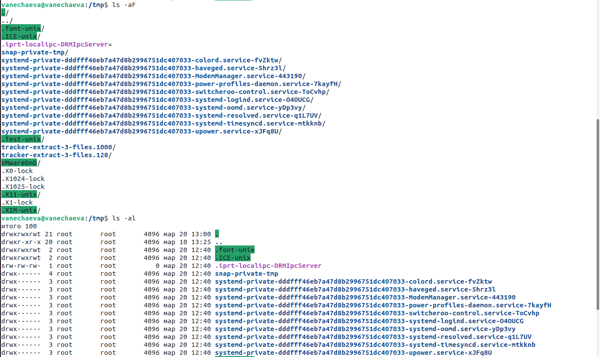

---
## Front matter
title: "Лабораторная работа №5 по предмету Операционные системы"
subtitle: "Группа НПМбв-02-19"
author: "Нечаева Виктория Алексеевна"

## Generic otions
lang: ru-RU
toc-title: "Содержание"

## Bibliography
bibliography: bib/cite.bib
csl: pandoc/csl/gost-r-7-0-5-2008-numeric.csl

## Pdf output format
toc: true # Table of contents
toc-depth: 2
lof: true # List of figures
lot: true # List of tables
fontsize: 12pt
linestretch: 1.5
papersize: a4
documentclass: scrreprt
## I18n polyglossia
polyglossia-lang:
  name: russian
polyglossia-otherlangs:
  name: english
## I18n babel
babel-lang: russian
babel-otherlangs: english
## Fonts
mainfont: PT Serif
romanfont: PT Serif
sansfont: PT Sans
monofont: PT Mono
mainfontoptions: Ligatures=TeX
romanfontoptions: Ligatures=TeX
sansfontoptions: Ligatures=TeX,Scale=MatchLowercase
monofontoptions: Scale=MatchLowercase,Scale=0.9
## Biblatex
biblatex: true
biblio-style: "gost-numeric"
biblatexoptions:
  - parentracker=true
  - backend=biber
  - hyperref=auto
  - language=auto
  - autolang=other*
  - citestyle=gost-numeric
## Pandoc-crossref LaTeX customization
figureTitle: "Рис."
tableTitle: "Таблица"
listingTitle: "Листинг"
lofTitle: "Список иллюстраций"
lotTitle: "Список таблиц"
lolTitle: "Листинги"
## Misc options
indent: true
header-includes:
  - \usepackage{indentfirst}
  - \usepackage{float} # keep figures where there are in the text
  - \floatplacement{figure}{H} # keep figures where there are in the text
---

# Цель работы

Приобретение практических навыков взаимодействия пользователя с системой посредством командной строки.

# Задание

1. Определите полное имя вашего домашнего каталога. Далее относительно этого каталога будут выполняться последующие упражнения.
2. Выполните следующие действия:\
2.1. Перейдите в каталог /tmp.\
2.2. Выведите на экран содержимое каталога /tmp. Для этого используйте команду ls с различными опциями. Поясните разницу в выводимой на экран информации.\
2.3. Определите, есть ли в каталоге /var/spool подкаталог с именем cron?\
2.4. Перейдите в Ваш домашний каталог и выведите на экран его содержимое.
Определите, кто является владельцем файлов и подкаталогов?\
3. Выполните следующие действия:\
3.1. В домашнем каталоге создайте новый каталог с именем newdir.\
3.2. В каталоге ~/newdir создайте новый каталог с именем morefun.\
3.3. В домашнем каталоге создайте одной командой три новых каталога с именами letters, memos, misk. Затем удалите эти каталоги одной командой.\
3.4. Попробуйте удалить ранее созданный каталог ~/newdir командой rm. Проверьте, был ли каталог удалён.\
3.5. Удалите каталог ~/newdir/morefun из домашнего каталога. Проверьте, был ли каталог удалён.\
4. С помощью команды man определите, какую опцию команды ls нужно использовать для просмотра содержимое не только указанного каталога, но и подкаталогов, входящих в него.
5. С помощью команды man определите набор опций команды ls, позволяющий отсортировать по времени последнего изменения выводимый список содержимого каталога с развёрнутым описанием файлов.
6. Используйте команду man для просмотра описания следующих команд: cd, pwd, mkdir, rmdir, rm. Поясните основные опции этих команд.
7. Используя информацию, полученную при помощи команды history, выполните модификацию и исполнение нескольких команд из буфера команд.

# Выполнение лабораторной работы
## Пункт 1
Определяю полное имя домашнего каталога с помощью команды pwd (рис.1).

## Пункт 2
Перейдите в каталог /tmp..

Выведите на экран содержимое каталога /tmp. Для этого используйте команду ls (рис.2, рис.3) с различными опциями. Поясните разницу в выводимой на экран информации.

ls -alF дает визуальную информацию о типе файла, показывается скрытые файлы и дает инфо о правах доступа к файлам\
ls -af показывается скрытые файлы и дает информацию о типах файлов\
ls -al показывается скрытые файлы и дает информацию о правах доступа к файлам

Определите, есть ли в каталоге /var/spool подкаталог с именем cron?\
Перехожу в каталог (рис.4) и с помощью ls вижу cron.

Перейдите в Ваш домашний каталог и выведите на экран его содержимое.
Определите, кто является владельцем файлов и подкаталогов?

Владельцем является пользователь (рис.5), под которым документы были созданы. У меня один пользователь -- vanechaeva -- поэтому этот пользователь владелец всех документов.

## Пункт 3
В домашнем каталоге создайте (рис.6) новый каталог с именем newdir.

В каталоге ~/newdir создайте (рис.6) новый каталог с именем morefun.

В домашнем каталоге создайте (рис.7) одной командой три новых каталога с именами letters, memos, misk. Затем удалите (рис.7) эти каталоги одной командой.

Попробуйте удалить ранее созданный каталог ~/newdir командой rm (рис.8). Проверьте, был ли каталог удалён.\
Каталог не удалится, так как он пустой и для его удаления надо задать опцию -r.

Удалите каталог ~/newdir/morefun из домашнего каталога. Проверьте, был ли каталог удалён.
rmdir позволяет удалять пустые каталоги (рис.9) без дополнительных опций, в отличие от rm. Каталог morefun удалится.

## Пункт 4
С помощью команды man определите, какую опцию команды ls нужно использовать для просмотра содержимое не только указанного каталога, но и подкаталогов, входящих в него.\
В man указано про опцию -R (рис.10), которая позволяет рекурсивно просмотреть содержание подкаталогов.\
Еще можно использовать звездочку (рис.11), которая делает по факту то же самое, что и -R.

## Пункт 5
С помощью команды man определите набор опций команды ls, позволяющий отсортировать по времени последнего изменения выводимый список (рис.12) содержимого каталога с развёрнутым описанием файлов.\
- -sort=time сортирует по дате и времени, снизу вверх\
- -time=ctime указывает в списке время последнего изменения\
-lF показывает детали о подкаталогах

## Пункт 6
Используйте команду man для просмотра описания следующих команд: cd, pwd, mkdir, rmdir, rm. Поясните основные опции этих команд.\

### cd

 -L -- переходить по символическим ссылкам. По умолчанию cd ведет себя так, как если бы указана опция -L.\
 -P -- не переходить по символическим ссылкам. Другими словами, когда эта опция указана, и вы пытаетесь перейти к символической ссылке, которая указывает на каталог, cd перейдет в каталог.\

### pwd

 -L, --logical - брать директорию из переменной окружения, даже если она содержит символические ссылки.\
 -P - отбрасывать все символические ссылки.\
--help - отобразить справку по утилите.\
--version - отобразить версию утилиты.

### mkdir

-m=MODE или --mode=MODE -- Устанавливает права доступа для создаваемой директории.\
-p или --parents -- Создать все директории, которые указаны внутри пути. Если какая-либо директория существует, то предупреждение об этом не выводится.\
-v или --verbose -- Выводить сообщение о каждой создаваемой директории.\
-Z -- Установить контекст SELinux для создаваемой директории по умолчанию.\
--context[=CTX] -- Установить контекст SELinux для создаваемой директории в значение CTX\
--help -- Показать справку по команде mkdir\
--version -- Показать версию утилиты mkdir

### rmdir

-p -- Если каталог включает более, чем один компонент пути, то удаляется каталог, затем убирается последний компонент пути и удаляется получившийся каталог и т. д. до тех пор, пока все компоненты не будут удалены.\
--ignore-fail-on-non-empty -- Обычно rmdir будет отказываться удалять непустые каталоги. Данная опция заставляет rmdir игнорировать ошибки при удалении каталога, если эти ошибки вызваны тем, что каталог не пуст.\
--help -- Показать справку по команде rmdir\
--version -- Показать версию утилиты rmdir

### rm

-f или --force -- Игнорировать несуществующие файлы и аргументы. Никогда не выдавать запросы на подтверждение удаления.\
-i -- Выводить запрос на подтверждение удаления каждого файла.\
-I -- Выдать один запрос на подтверждение удаления всех файлов, если удаляется больше трех файлов или используется рекурсивное удаление. Опция применяется, как более «щадящая» версия опции -i\
--interactive[=КОГДА]. Вместо КОГДА можно использовать:

    never — никогда не выдавать запросы на подтверждение удаления.
    once — выводить запрос один раз (аналог опции -I).
    always — выводить запрос всегда (аналог опции -i).

Если значение КОГДА не задано, то используется always\
--one-file-system -- Во время рекурсивного удаления пропускать директории, которые находятся на других файловых системах.\
--no-preserve-root -- Если в качестве директории для удаления задан корневой раздел /, то считать, что это обычная директория и начать выполнять удаление.\
--preserve-root -- Если в качестве директории для удаления задан корневой раздел /, то запретить выполнять команду rm над корневым разделом. Данное поведение используется по умолчанию.\
-r или -R или --recursive -- Удаление директорий и их содержимого. Рекурсивное удаление.\
-d или --dir -- Удалять пустые директории.\
-v или --verbose -- Выводить информацию об удаляемых файлах.

## Пункт 7
Используя информацию, полученную при помощи команды history, выполните модификацию и исполнение нескольких команд (рис.18, рис.19) из буфера команд.

# Выводы

В ходе данной лабораторной работы мною были приобретены практические навыки взаимодействия с системой Ubuntu посредством командной строки.

# Контрольные вопросы
1. Что такое командная строка?\
Командная строка - это интерфейс командной строки, который позволяет пользователю взаимодействовать с операционной системой, вводя команды в текстовой форме. В командной строке можно запускать исполняемые файлы, управлять файлами и папками, настраивать систему и многое другое.

2. При помощи какой команды можно определить абсолютный путь текущего каталога? Приведите пример.\
Для определения абсолютного пути текущего каталога можно использовать команду "pwd" (print working directory).

3. При помощи какой команды и каких опций можно определить только тип файлов и их имена в текущем каталоге? Приведите примеры.\
ls -F

4. Какие файлы считаются скрытыми? Как получить информацию о скрытых файлах? Приведите примеры.\
В Linux, файлы и директории, имена которых начинаются с точки (.), считаются скрытыми. Эти файлы не отображаются в обычных листингах директорий и не участвуют в обычных операциях поиска и сортировки файлов.\
Чтобы получить информацию о скрытых файлах, можно использовать команду ls с флагом -a.

5. При помощи каких команд можно удалить файл и каталог? Можно ли это сделать одной и той же командой? Приведите примеры.\
rm удаляет файл, rm -r или rmdir удаляют каталог

6. Как определить, какие команды выполнил пользователь в сеансе работы?\
С помощью команды history.

7. Каким образом можно исправить и запустить на выполнение команду, которую пользователь уже использовал в сеансе работы? Приведите примеры.\
Вызвать history, вызвать в консоли !<номер_команды>:s/<что_меняем>/<на_что_меняем>, где номер команды -- номер из списка вывода history.

8. Можно ли в одной строке записать несколько команд? Если да, то как? Приведите примеры.\
Можно через точку с запятой указать из в консоли (;).

9. Что такое символ экранирования? Приведите примеры использования этого символа.\
Это бэкслэш (\), который говорит о том, что следующий символ должен восприниматься не как служебный, а как обычный символ.

10. Какая информация выводится на экран о файлах и каталогах, если используется опция l в команде ls?\
Информация о правах доступа к файлам и документам.

11. Что такое относительный путь к файлу? Приведите примеры использования относительного и абсолютного пути при выполнении какой-либо команды.\
Абсолютные пути указывают положение файла или директории относительно директории root. Их можно узнать по слэшу в начале пути. Относительные пути указывают положение файла или директории относительно ващего текущего местоположения в системе. Они не начинаются со слэша.

12. Как получить информацию об интересующей вас команде?\
С помощью man <название_команды> или <название_команды> - - help.

13. Какая клавиша или комбинация клавиш служит для автоматического дополнения вводимых команд?\
Tab.
