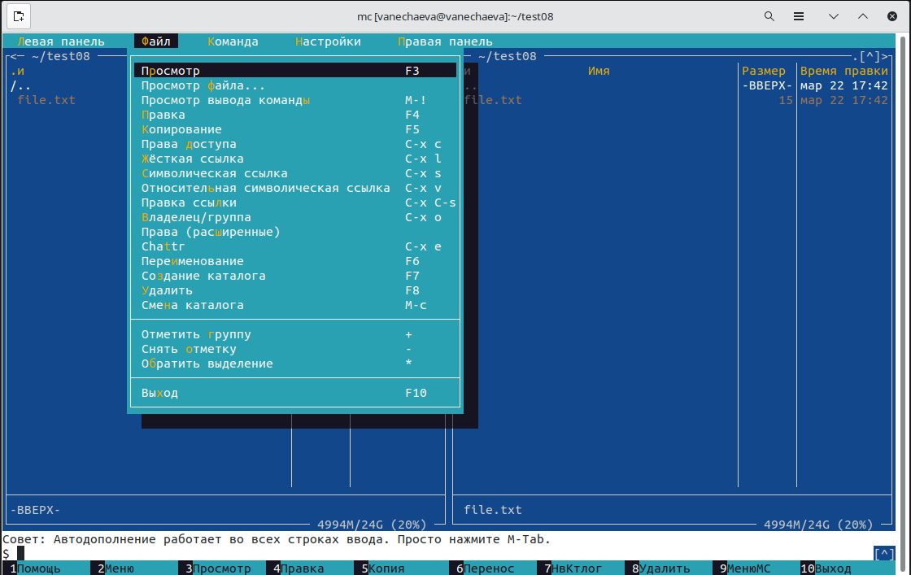
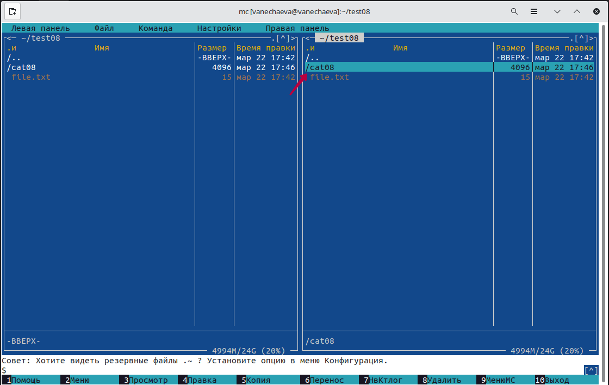
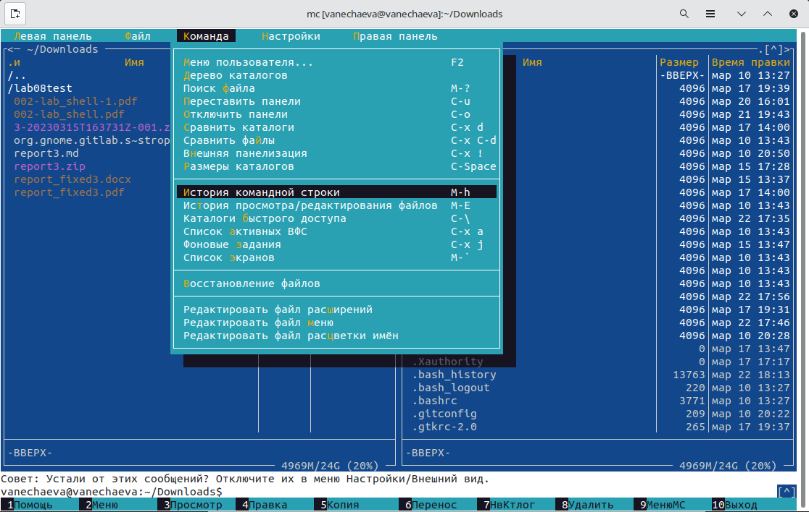

---
## Front matter
title: "Лабораторная работа №8 по предмету Операционные системы"
subtitle: "Группа НПМбв-02-19"
author: "Нечаева Виктория Алексеевна"

## Generic otions
lang: ru-RU
toc-title: "Содержание"

## Bibliography
bibliography: bib/cite.bib
csl: pandoc/csl/gost-r-7-0-5-2008-numeric.csl

## Pdf output format
toc: true # Table of contents
toc-depth: 2
lof: true # List of figures
lot: true # List of tables
fontsize: 12pt
linestretch: 1.5
papersize: a4
documentclass: scrreprt
## I18n polyglossia
polyglossia-lang:
  name: russian
polyglossia-otherlangs:
  name: english
## I18n babel
babel-lang: russian
babel-otherlangs: english
## Fonts
mainfont: PT Serif
romanfont: PT Serif
sansfont: PT Sans
monofont: PT Mono
mainfontoptions: Ligatures=TeX
romanfontoptions: Ligatures=TeX
sansfontoptions: Ligatures=TeX,Scale=MatchLowercase
monofontoptions: Scale=MatchLowercase,Scale=0.9
## Biblatex
biblatex: true
biblio-style: "gost-numeric"
biblatexoptions:
  - parentracker=true
  - backend=biber
  - hyperref=auto
  - language=auto
  - autolang=other*
  - citestyle=gost-numeric
## Pandoc-crossref LaTeX customization
tableTitle: "Таблица"
listingTitle: "Листинг"
lofTitle: "Список иллюстраций"
lotTitle: "Список таблиц"
lolTitle: "Листинги"
## Misc options
indent: true
header-includes:
  - \usepackage{indentfirst}
  - \usepackage{float} # keep figures where there are in the text
  - \floatplacement{figure}{H} # keep figures where there are in the text
---

# Цель работы

Освоение основных возможностей командной оболочки Midnight Commander. Приобретение навыков практической работы по просмотру каталогов и файлов; манипуляций с ними.

# Задание

## Задание по mc
1. Изучите информацию о mc, вызвав в командной строке man mc.
2. Запустите из командной строки mc, изучите его структуру и меню.
3. Выполните несколько операций в mc, используя управляющие клавиши
(операции с панелями; выделение/отмена выделения файлов, копирова-
ние/перемещение файлов, получение информации о размере и правах доступана файлы и/или каталоги и т.п.)
4. Выполните основные команды меню левой (или правой) панели. Оцените степень подробности вывода информации о файлах.
5. Используя возможности подменю Файл, выполните:\
– просмотр содержимого текстового файла;\
– редактирование содержимого текстового файла (без сохранения результатов редактирования);\
– создание каталога;\
– копирование в файлов в созданный каталог.\
6. С помощью соответствующих средств подменю Команда осуществите:\
– поиск в файловой системе файла с заданными условиями (например, файла с расширением .c или .cpp, содержащего строку main);\
– выбор и повторение одной из предыдущих команд;\
– переход в домашний каталог;\
– анализ файла меню и файла расширений.\
7. Вызовите подменю Настройки. Освойте операции, определяющие структуру экрана mc (Full screen, Double Width, Show Hidden Files и т.д.)

## Задание по встроенному редактору mc

1. Создайте текстовой файл text.txt.
2. Откройте этот файл с помощью встроенного в mc редактора.
3. Вставьте в открытый файл небольшой фрагмент текста, скопированный из любого другого файла или Интернета.
4. Проделайте с текстом следующие манипуляции, используя горячие клавиши:\
4.1. Удалите строку текста.\
4.2. Выделите фрагмент текста и скопируйте его на новую строку.\
4.3. Выделите фрагмент текста и перенесите его на новую строку.\
4.4. Сохраните файл.\
4.5. Отмените последнее действие.\
4.6. Перейдите в конец файла (нажав комбинацию клавиш) и напишите некоторый текст.\
4.7. Перейдите в начало файла (нажав комбинацию клавиш) и напишите некоторый текст.\
4.8. Сохраните и закройте файл.\
5. Откройте файл с исходным текстом на некотором языке программирования (например C или Java)
6. Используя меню редактора, включите подсветку синтаксиса, если она не включена, или выключите, если она включена.

# Выполнение лабораторной работы

После выполнения лабораторной работы осознала, что у меня nano, а не mcedit. Поменяла только в последнем пункте выполнения лабораторной работы. Поэтому тут буду описаны хоткеи для работы в nano, а не mcedit.

## Задание по mc

Выполните основные команды меню левой (или правой) панели. Оцените степень подробности вывода информации о файлах.

Смотрю на левой панели.\
Основная команда -- список файлов -- открывается по умолчанию при вызове mc.

Формат списка файлов (рис. 1) -- настройка вывода информации о файлах в списке.

Информация -- отображает инфо по размеру, правах доступа и других характеристикам файла/папки (рис. 2)

Дерево -- показывает дерево каталогов файловой системы (рис. 3)

Быстрый просмотр -- показывает содержимое файла, если это невозможно, сообщает "Просмотр невозможен: необычный файл" (рис. 4)

Порядок сортировки -- настройка сортировки (рис. 5)

Выбор кодировки -- по умолчанию без перекодировки (рис. 6)

### Подменю Файл

Используя возможности подменю Файл, выполните:\
– просмотр содержимого текстового файла;\
– редактирование содержимого текстового файла (без сохранения результатов редактирования);

Сочетание клавиш на ноуте -- Fn + F3 (рис. 7, 7.1) Для выхода без сохранения в nano Ctrl + X, потом выбрать N (нет) и Enter (рис. 8, 8.1)

– создание каталога;\
В mc клавиша F7 (рис. 9)

– копирование в файлов в созданный каталог.\
В mc клавиша F5 (рис. 10)

### Подменю Команда
С помощью соответствующих средств подменю Команда осуществите:\
– поиск в файловой системе файла с заданными условиями (например, файла с расширением .c или .cpp, содержащего строку main);

Задаю маску поочередно, сначала для .c, потом для .cpp. (рис. 11, 12) .cpp в системе у меня нет, поэтому руками создаю файл lab08.cpp и пишу строчку с одним словом -- main (рис. 13, 14)

– выбор и повторение одной из предыдущих команд (рис. 15-18)

– переход в домашний каталог;

Выбрать в Команда Дерево каталогов и выбрать куда хотим попасть (рис. 19)

– анализ файла меню и файла расширений.

Оба файла можно редактировать и дополнять для изменения настроек (рис. 20-21)

## Задание по встроенному редактору mc (nano)

Только после того, как выполнила работу, поняла, что у меня хоткеи другие, так как у меня не mcedit, а nano. Я буду их здесь указывать.

Создайте текстовой файл text.txt (рис. 22)

Откройте этот файл с помощью встроенного в mc редактора. Вставьте в открытый файл небольшой фрагмент текста, скопированный из любого другого файла или Интернета (рис. 23)

Далее идут команды, которые скриншотами не описать, выполнение есть на скринкасте.

Удалите строку текста -- Ctrl + K\
Выделите фрагмент текста и скопируйте его на новую строку -- Alt + A начать выделение, клавишами выделить, Alt + 6 копировать, Ctrl + U вставить\
Выделите фрагмент текста и перенесите его на новую строку -- Alt + A начать выделение, клавишами выделить, Ctrl + K вырезать, Ctrl + U вставить\
Сохраните файл -- Ctrl + O\
Отмените последнее действие -- Alt + U

Перейдите в конец/начало файла (нажав комбинацию клавиш) и напишите некоторый текст -- Ctrl + / (К строке), Ctrl + V/Y (первая строка, последняя строка) (рис. 24)

Сохраните и закройте файл -- Ctrl + O, Ctrl + X\
Откройте файл с исходным текстом на некотором языке программирования (например C или Java)\
Используя меню редактора, включите подсветку синтаксиса, если она не включена, или выключите, если она включена.

Это я не записала на скринкасте. Поставила настройку встроенного редактора mcedit, открыла файл .c, поставила цветовыделение для C Program.

# Выводы

В данной лабораторной работе я освоила основные возможности командной оболочки Midnight Commander, приобрела навыки практической работы по просмотру каталогов и файлов и манипуляций с ними.

# Контрольные вопросы

1. Какие режимы работы есть в mc. Охарактеризуйте их.

Форматы отображения списка файлов\
Вид панелей, в которых отображаются списки файлов и подкаталогов, может быть изменен через пункты выпадающих меню левой и правой панелей "Левая" ("Left") и "Правая" ("Right") главного меню.
Если Вы хотите изменить формат представления списка файлов в панели, Вы можете воспользоваться пунктом "Формат списка..." соответствующей (левой или правой) панели. Имеется возможность выбрать один из 4 вариантов представления списка файлов: "Стандартный" (Full), "Укороченный" (Brief), "Расширенный" (Long) и "Определяемый пользователем" (User).

В "стандартном" формате отображаются имя файла, его размер и время последней модификации.

В "укороченном" (brief) формате отображаются только имена файлов, за счет чего на панели умещаются две колонки (и видно вдвое больше имен).

В "расширенном" (long) формате содержимое каталога представляется так, как это делает команда "ls -l". В этом формате панель занимает весь экран.

Если Вы выберете формат "определяемый пользователем" ("User"), Вы должны будете задать структуру отображаемой информации.

Режим "Информация"\
В этом режиме на панель выводится информация о подсвеченном в другой панели файле и о текущей файловой системе (тип, свободное пространство и число свободных inode).
Программа Midnight Commander

Режим "Дерево"\
В режиме отображения дерева каталогов Вы увидите в одной из панелей изображение, подобное приведенному на следующем рисунке:
Этот режим подобен тому, который Вы увидите, выбрав пункт "Дерево каталогов" из меню "Команды".

Режим "Быстрый просмотр" ("Quick View")\
В этом режиме панель переключается на отображение содержимого файла, подсвеченного в другой панели. Для примера приведем вид экрана при быстром просмотре файла /etc/fstab.

Режимы "Сетевое соединение" и "FTP-соединение"\
Эти два режима используются для отображения списка каталогов, располагающихся на удаленных компьютерах. В остальном формат вывода информации аналогичен форматам, используемым для отображения локальных каталогов. Описание того, как пользоваться этими режимами,  будет дано позже.

2. Какие операции с файлами можно выполнить как с помощью команд shell, так и с помощью меню (комбинаций клавиш) mc? Приведите несколько примеров.

Копирование файлов: Вы можете скопировать файлы, используя команду cp в shell, или используя команду Копирование в mc.

Удаление файлов: Вы можете удалить файлы, используя команду rm в shell, или используя функцию Удалить (F8) в mc.

Создание каталогов: Вы можете создать каталоги, используя команду mkdir в shell, или используя функцию Создание каталога (F7) в mc.

Поиск файлов: Вы можете найти файлы, используя команду find в shell, или используя функцию Поиск файла в mc.

3. Опишите структура меню левой (или правой) панели mc, дайте характеристику командам.

Пункты меню "Левая" и "Правая" позволяют изменить вид, соответственно, левой и правой панелей, и характер отображаемой в панели информации, в частности, выполнить соединения с удаленными компьютерами. 

Левая панель содержит список файлов и каталогов текущего рабочего каталога. По умолчанию, она также содержит набор команд и функций, которые могут быть выполнены для выбранных файлов и каталогов в правой панели. Эти команды доступны через меню, расположенное в верхней части левой панели.
Можно отображать на одной из панелей информацию о файле, его содержимое, дерево каталогов и также настроить сортировку и кодировку.

4. Опишите структура меню Файл mc, дайте характеристику командам.

Структура меню Файл в Midnight Commander (mc) включает в себя следующие команды:

Просмотр содержимого - команда "Просмотр" (F3). Она отображает содержимое файла.

Копирование файлов - команда "Копирование" (F5). Она позволяет выбрать файлы для копирования и выбрать папку, в которую они будут скопированы.

Создание нового каталога - команда "Создание каталога" (F7). Она создает новый каталог в текущей директории.

Удаление файлов - команда "Удалить" (F8). Она позволяет выбрать файлы для удаления.

Переименование файлов - команда "Переименование" (F6). Она позволяет переименовать выбранный файл.

5. Опишите структура меню Команда mc, дайте характеристику командам.

Поиск файлов - команда "Поиск" (Alt+F7). Она позволяет найти файлы по заданной маскеи и содержимому.

Другие команды относятся к редактированию файлов расширений и меню и настройке панелей mc.

6. Опишите структура меню Настройки mc, дайте характеристику командам.

Меню  "Настройки" служит для задания ряда параметров, определяющих внешний вид и поведение программы Midnight Commander. Один из пунктов этого меню служит для  сохранения  настроек, заданных пользователем

7. Назовите и дайте характеристику встроенным командам mc.

Работа с панелями Midnight Commander

Ctrl + R - обновить активную панель\
Ctrl + \ - справочник каталогов быстрого доступа\
Ctrl + S или M + S - поиск файлов в текущем каталоге по начальным символам\
Ctrl + X H - добавить текущий каталог в справочник каталогов быстрого доступа\
M + G - перейти на первый файл или каталог в видимом списке на панели\
M + J - перейти на последний файл или каталог в видимом списке на панели\
M + R - перейти на средний файл или каталог в видимом списке на панели\
M + O - неактивная панель = активная панель\
M + . - показывать/скрыть скрытые файлы и каталоги\
M + T - cменить вид панели (стандартный, укороченный, расширенный\ + (Plus) - вызвать окно для выделения группы файлов (можно использовать регулярные выражения)\
\ (Backslash) - снять выделение с группы файлов (действие, обратное тому, которое вызывается по клавише "+").

Работа с файлами Midnight Commander

F3 - просмотр файла.\
F4 - редактирование файла.\
Shift + F4 - открыть редактор на изменение нового файла, при сохранении будет запрошено его имя\
Shift + F5 - копирование файла в тот же каталог\
Shift + F6 - инлайн-переименование текущего файла\
Ctrl + X C - посмотреть/поменять права (chmod) для отмеченных файлов\
Ctrl + X I - быстрый просмотр информации о текущем объекте на второй панели\
Ctrl + X O - посмотреть/поменять владельца (chown) для отмеченных файлов\
Ctrl + X Q - быстрый просмотр содержимого файла на второй панели\
Ctrl + X S - создать символическую ссылку (symlink)\
Ctrl + N  - создать новый файл.\
Ctrl + F  - копировать выделенный текст в файл.\
Shift + F5  - вставка текста из файла.

Работа с командной строкой Midnight Commander

Alt + ENTER - вставить файл или каталог, на котором установлен курсор в командную строку.\
Alt + A - вставить в командную строку полный путь в активной панели.\
Alt + P - вернуть предыдущую выполненную команду в командную строку.M + Enter - вставляет в командную строку имя файла, на котором находится курсор\
Alt + T - смена режима отображения панели.\
Alt + [.] - скрыть или показать скрытые файлы и каталоги начинаются на точку.\
Alt + A - вставить в командную строку полный путь в активной панели.\
Alt + C - смена текущего каталога.\
Alt + H - просмотр последних выполненных команд.\
Alt + I - смена каталога на неактивной панели, на каталог в котором вы находитесь.\
Alt + O - неактивная панель переходит в каталог на который указывает активная панель.M + P - показывает в командной строке предыдущую команду\
M + N - показывает в командной строке следующую команду\
M + или Esc + - авто-дополнение команды, если вариантов несколько - то повторное нажатие высвечивает список возможных вариантов
Ctrl + X P или M + A - вставить в командную строку путь текущей панели\
Ctrl + X T - вставить в командную строку выделенные объекты\
Ctrl + X, Q - просмотр содержимого файла на второй панели.\
Ctrl + X, I - просмотр информации о текущем объекте на второй панели.\
Ctrl + O - скрыть или показать панели.\
Ctrl + R - перечитать содержимое каталога.\
Ctrl + Space - показать размер текущего каталога.

8. Назовите и дайте характеристику командам встроенного редактора mc.

Ctrl+y Удаление строки\
Ctrl+u Отмена последней операции редактирования\
Ins Переключение вставка/замена (insert/overtype)\
F7 Поиск (можно использовать регулярные выражения)\
Shift+F7 Повтор последней операции поиска\
F4 Замена\
F3 Первое нажатие -- начало отметки блока, второе -- конец\
F5 Копирование выделенного фрагмента\
F6 Перемещение выделенного фрагмента\
F8 Удаление текущей строки\
Ctrl+f 	Запись в файл\
Shift+F5 Чтение из файла\
Shift+F4 Создание нового файла\
F2 	Сохранение файла\
F10 Завершение работы\

9. Дайте характеристику средствам mc, которые позволяют создавать меню, определяемые пользователем.

Cредства mc (midnight commander) позволяют создавать меню, определяемые пользователем, путем настройки конфигурационных файлов и скриптов.

В частности, с помощью команды mc -e можно запустить редактор mcedit, который позволяет создавать и редактировать файлы конфигурации меню mc. В файле mc.menu можно определить свои собственные команды, подменю и ключи, которые будут отображаться в меню mc.

Дополнительно, в файле mc.ext можно определить дополнительные типы файлов и ассоциировать с ними команды. Например, можно определить команду для просмотра pdf-файлов в меню mc.

Также можно использовать средства mc для создания собственных команд, скриптов и функций, которые могут быть запущены из меню mc.

10. Дайте характеристику средствам mc, которые позволяют выполнять действия, определяемые пользователем, над текущим файлом.

Средства mc (midnight commander) позволяют выполнять действия, определяемые пользователем, над текущим файлом с помощью различных функций и команд.

В частности, можно использовать команду User Menu (Alt + F2), которая позволяет запускать предопределенные или пользовательские команды над текущим файлом. Для этого пользователь может создать свой собственный файл конфигурации меню mc, в котором определить нужные команды.

