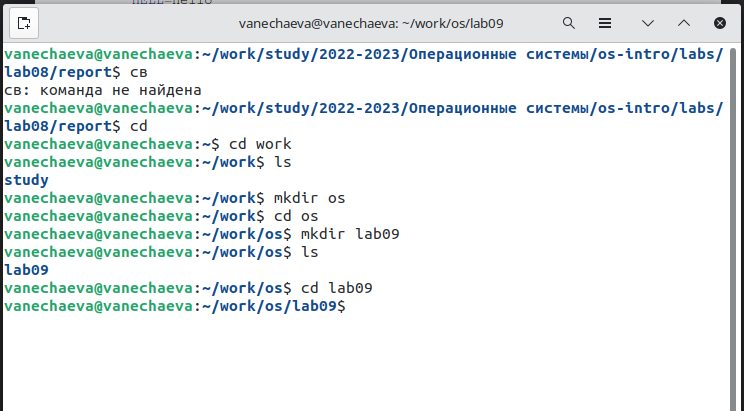
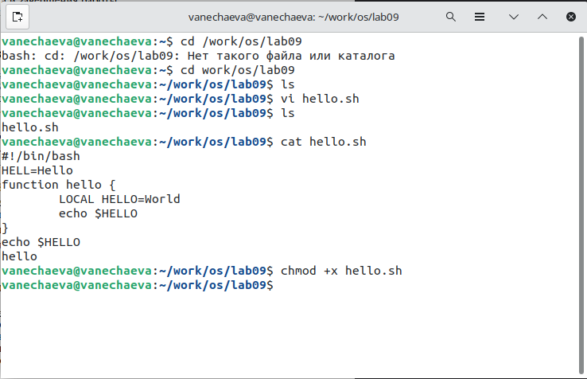
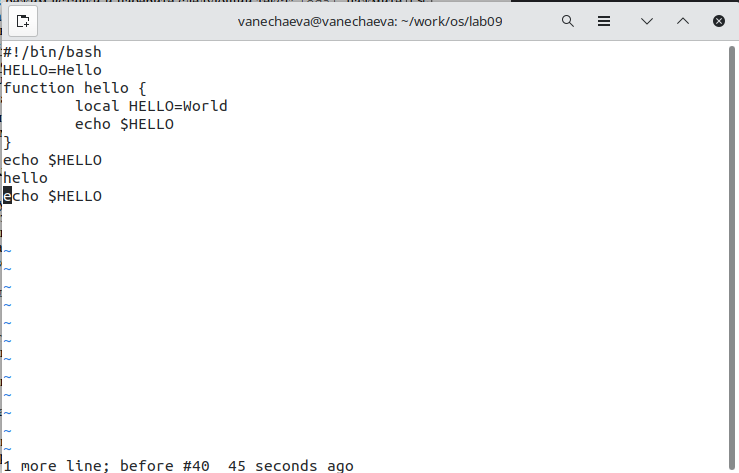
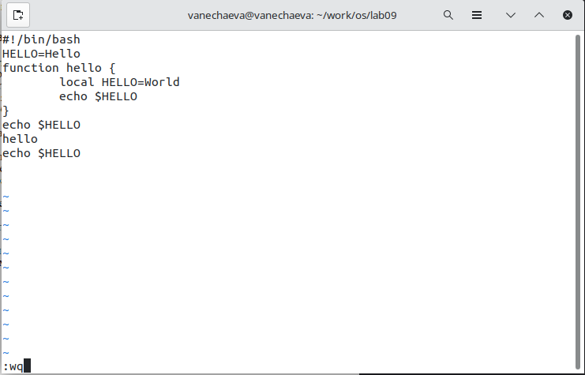
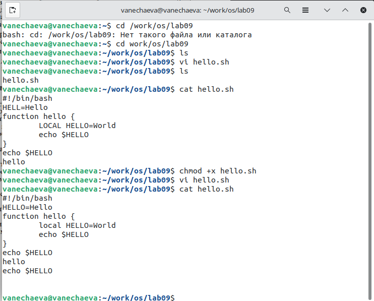

---
## Front matter
title: "Лабораторная работа №9 по предмету Операционные системы"
subtitle: "Группа НПМбв-02-19"
author: "Нечаева Виктория Алексеевна"

## Generic otions
lang: ru-RU
toc-title: "Содержание"

## Bibliography
bibliography: bib/cite.bib
csl: pandoc/csl/gost-r-7-0-5-2008-numeric.csl

## Pdf output format
toc: true # Table of contents
toc-depth: 2
lof: true # List of figures
lot: true # List of tables
fontsize: 12pt
linestretch: 1.5
papersize: a4
documentclass: scrreprt
## I18n polyglossia
polyglossia-lang:
  name: russian
polyglossia-otherlangs:
  name: english
## I18n babel
babel-lang: russian
babel-otherlangs: english
## Fonts
mainfont: PT Serif
romanfont: PT Serif
sansfont: PT Sans
monofont: PT Mono
mainfontoptions: Ligatures=TeX
romanfontoptions: Ligatures=TeX
sansfontoptions: Ligatures=TeX,Scale=MatchLowercase
monofontoptions: Scale=MatchLowercase,Scale=0.9
## Biblatex
biblatex: true
biblio-style: "gost-numeric"
biblatexoptions:
  - parentracker=true
  - backend=biber
  - hyperref=auto
  - language=auto
  - autolang=other*
  - citestyle=gost-numeric
## Pandoc-crossref LaTeX customization
figureTitle: "Рис."
tableTitle: "Таблица"
listingTitle: "Листинг"
lofTitle: "Список иллюстраций"
lotTitle: "Список таблиц"
lolTitle: "Листинги"
## Misc options
indent: true
header-includes:
  - \usepackage{indentfirst}
  - \usepackage{float} # keep figures where there are in the text
  - \floatplacement{figure}{H} # keep figures where there are in the text
---

# Цель работы

Познакомиться с операционной системой Linux. Получить практические навыки работы с редактором vi, установленным по умолчанию практически во всех дистрибутивах.

# Задание

## Задание 1. Создание нового файла с использованием vi
1. Создайте каталог с именем ~/work/os/lab06.\
2. Перейдите во вновь созданный каталог.\
3. Вызовите vi и создайте файл hello.sh \
4. Нажмите клавишу i и введите код из лабораторной работы.\
5. Нажмите клавишу Esc для перехода в командный режим после завершения ввода текста.\
6. Нажмите : для перехода в режим последней строки и внизу вашего экрана появится приглашение в виде двоеточия.\
7. Нажмите w (записать) и q (выйти), а затем нажмите клавишу Enter для сохранения вашего текста и завершения работы.\
8. Сделайте файл исполняемым chmod +x hello.sh\

## Задание 2. Редактирование существующего файла
1. Вызовите vi на редактирование файла vi ~/work/os/lab06/hello.sh\
2. Установите курсор в конец слова HELL второй строки.\
3. Перейдите в режим вставки и замените на HELLO. Нажмите Esc для возврата в командный режим.\
4. Установите курсор на четвертую строку и сотрите слово LOCAL.
5. Перейдите в режим вставки и наберите следующий текст: local, нажмите Esc для возврата в командный режим.\
6. Установите курсор на последней строке файла. Вставьте после неё строку, содержащую следующий текст: echo $HELLO.\
7. Нажмите Esc для перехода в командный режим.\
8. Удалите последнюю строку.\
9. Введите команду отмены изменений u для отмены последней команды.\
10. Введите символ : для перехода в режим последней строки. Запишите произведённые изменения и выйдите из vi.\

# Выполнение лабораторной работы

В данной работе действия преимущественно совершаются с помощью горячиш клавиш и комбинаций на клавиатуре и фиксировать результат скриншотами тяжело, поэтому вся инфа на скринкасте.
## Выполнение Задания 1

1. Создайте каталог с именем ~/work/os/lab06.\
2. Перейдите во вновь созданный каталог (рис. 1)\


3. Вызовите vi и создайте файл hello.sh \
4. Нажмите клавишу i и введите код из лабораторной работы.\
5. Нажмите клавишу Esc для перехода в командный режим после завершения ввода текста.\
6. Нажмите : для перехода в режим последней строки и внизу вашего экрана появится приглашение в виде двоеточия.\
7. Нажмите w (записать) и q (выйти), а затем нажмите клавишу Enter для сохранения вашего текста и завершения работы.\
8. Сделайте файл исполняемым chmod +x hello.sh (рис. 2)\





## Выполнение Задания 2
1. Вызовите vi на редактирование файла vi ~/work/os/lab06/hello.sh\
2. Установите курсор в конец слова HELL второй строки.\
3. Перейдите в режим вставки и замените на HELLO. Нажмите Esc для возврата в командный режим.\
4. Установите курсор на четвертую строку и сотрите слово LOCAL.
5. Перейдите в режим вставки и наберите следующий текст: local, нажмите Esc для возврата в командный режим.\
6. Установите курсор на последней строке файла. Вставьте после неё строку, содержащую следующий текст: echo $HELLO.\
7. Нажмите Esc для перехода в командный режим.\
8. Удалите последнюю строку.\
9. Введите команду отмены изменений u для отмены последней команды.\
10. Введите символ : для перехода в режим последней строки. Запишите произведённые изменения и выйдите из vi (рис. 4)





# Выводы

В ходе данной лабораторной работы я получила практические навыки работы с редактором vi.

# Контрольные вопросы

1. Дайте краткую характеристику режимам работы редактора vi.

При запуске редактора vi вы оказываетесь в командном режиме. В этом режиме можно давать команды для редактирования файлов или перейти в другой режим. Например, вводя x в командном режиме мы удаляем символ, на который указывает курсор. Клавиши-стрелки перемещают курсор по редактируемому файлу. Как правило, команды, используемые в командном режиме, состоят из одного или двух символов.

Основной ввод и редактирование текста осуществляется в режиме ввода. При использовании редактора vi основное время, скорее всего, будет проводиться именно в этом режиме. Переход в режим ввода из командного режима осуществляется командой i (от слова insert). Находясь в режиме ввода, можно вводить текст в то место, куда указывает курсор. Выход из режима ввода в командный режим осуществляется клавишей Esc.

Режим последней строки — это специальный режим, в котором редактору даются сложные команды. При вводе этих команд они отображаются в последней строке экрана (отсюда пошло название режима). Например, если ввести в командном режиме команду :, то осуществится переход в режим последней строки, и можно будет вводить такие команды, как wq (записать файл и покинуть редактор vi) или q! (выйти из редактора vi без сохранения изменений). В режиме последней строки обычно вводятся команды, название которых состоит из нескольких символов. В этом режиме в последнюю строку вводится команда, после чего нажимается клавиша Enter, и команда исполняется.

2. Как выйти из редактора, не сохраняя произведённые изменения?

Перейти в режим последней строки и набрать : и q!

3. Назовите и дайте краткую характеристику командам позиционирования.

В vi для позиционирования курсора по тексту можно использовать следующие команды:

```h, j, k, l - перемещение курсора влево, вниз, вверх и вправо соответственно.

0 - перемещение курсора в начало строки.

 $ - перемещение курсора в конец строки.

    gg - перемещение курсора в начало файла.

    G - перемещение курсора в конец файла.

    <номер строки>G - перемещение курсора на указанную строку.

    w - перемещение курсора на следующее слово.

    b - перемещение курсора на предыдущее слово.

    e - перемещение курсора на конец следующего слова.```

4. Что для редактора vi является словом?

Для редактора vi словом считается последовательность символов, разделенных пробелами или символами перевода строки.

5. Каким образом из любого места редактируемого файла перейти в начало (конец) файла?

Для перехода в начало файла в режиме команд введите команду: gg, для перехода в конец файла - G.

6. Назовите и дайте краткую характеристику основным группам команд редактирования.

    Запуск/завершение\
    Статус\
    Режимы\
    Вставка текста\
    Перемещение\
    Удаление текста\
    Копирование в буфер\
    Изменение текста\
    Вставка из буфера\
    Буферы

7. Необходимо заполнить строку символами $. Каковы ваши действия?

Для заполнения строки символами "доллар" в Vi необходимо выполнить следующие действия:

Перейдите в командный режим, нажав клавишу "Esc" на клавиатуре.

Поместите курсор в начало строки, которую нужно заполнить символами доллар".

Введите команду "i" (вставить) и введите символ "доллар" столько раз, сколько надо.

Нажмите клавишу "Esc", чтобы вернуться в командный режим.

8. Как отменить некорректное действие, связанное с процессом редактирования?

Выйти в режим посл. строки, набрать : и U

9. Как определить, не перемещая курсора, позицию, в которой заканчивается строка?

Знак доллара перемещает курсор в конец текущей строки.