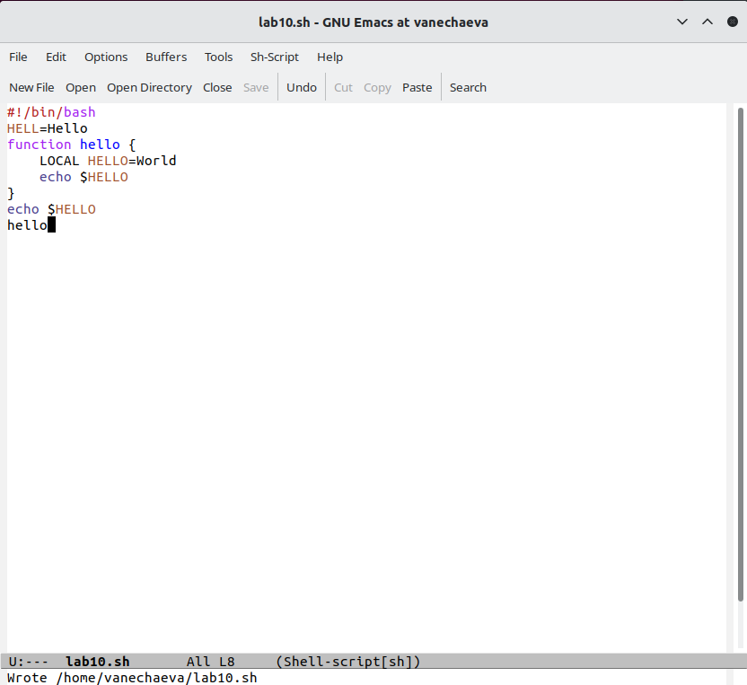
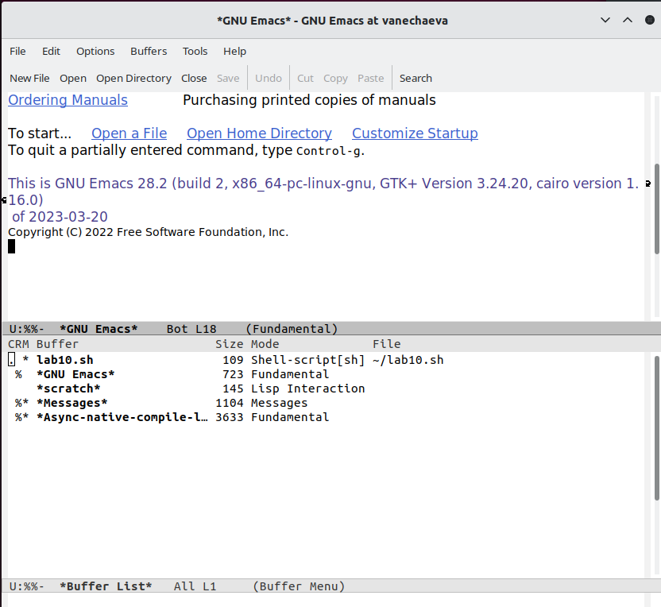
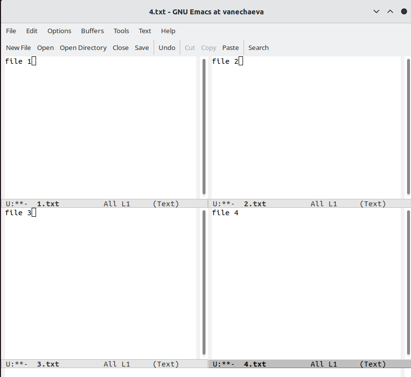
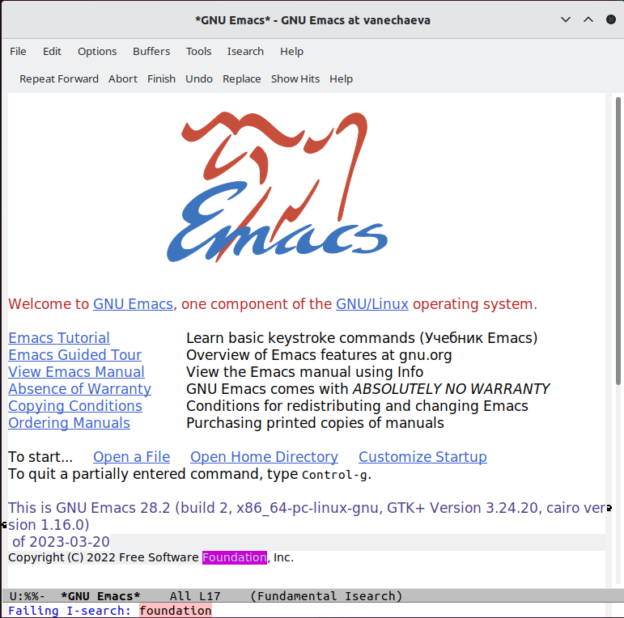
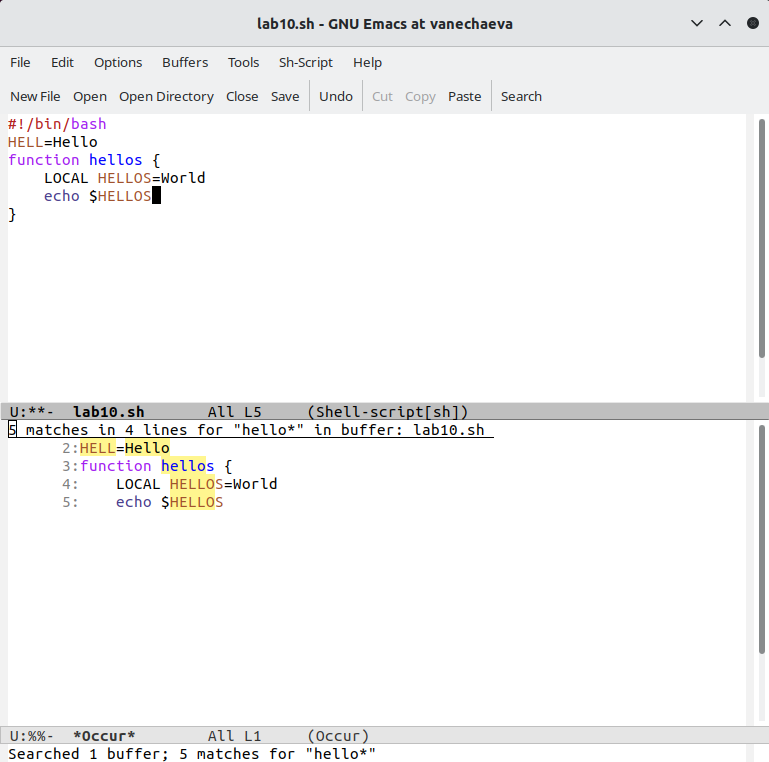

---
## Front matter
title: "Лабораторная работа №10 по предмету Операционные системы"
subtitle: "НПМбв-02-19"
author: "Нечаева Виктория Алексеевна"

## Generic otions
lang: ru-RU
toc-title: "Содержание"

## Bibliography
bibliography: bib/cite.bib
csl: pandoc/csl/gost-r-7-0-5-2008-numeric.csl

## Pdf output format
toc: true # Table of contents
toc-depth: 2
lof: true # List of figures
lot: true # List of tables
fontsize: 12pt
linestretch: 1.5
papersize: a4
documentclass: scrreprt
## I18n polyglossia
polyglossia-lang:
  name: russian
polyglossia-otherlangs:
  name: english
## I18n babel
babel-lang: russian
babel-otherlangs: english
## Fonts
mainfont: PT Serif
romanfont: PT Serif
sansfont: PT Sans
monofont: PT Mono
mainfontoptions: Ligatures=TeX
romanfontoptions: Ligatures=TeX
sansfontoptions: Ligatures=TeX,Scale=MatchLowercase
monofontoptions: Scale=MatchLowercase,Scale=0.9
## Biblatex
biblatex: true
biblio-style: "gost-numeric"
biblatexoptions:
  - parentracker=true
  - backend=biber
  - hyperref=auto
  - language=auto
  - autolang=other*
  - citestyle=gost-numeric
## Pandoc-crossref LaTeX customization
figureTitle: "Рис."
tableTitle: "Таблица"
listingTitle: "Листинг"
lofTitle: "Список иллюстраций"
lotTitle: "Список таблиц"
lolTitle: "Листинги"
## Misc options
indent: true
header-includes:
  - \usepackage{indentfirst}
  - \usepackage{float} # keep figures where there are in the text
  - \floatplacement{figure}{H} # keep figures where there are in the text
---

# Цель работы

Познакомиться с операционной системой Linux. Получить практические навыки работы с редактором Emacs.

# Задание

1. Ознакомиться с теоретическим материалом.
2. Ознакомиться с редактором emacs.
3. Выполнить упражнения.
4. Ответить на контрольные вопросы.

# Выполнение лабораторной работы

Скриншотов в данной лабораторной работе мало, так как практически нечего фиксировать.

1. Открыть emacs.
2. Создать файл lab07.sh с помощью комбинации Ctrl-x Ctrl-f (C-x C-f).
3. Наберите текст: (рис. 1)\
#!/bin/bash\
HELL=Hello\
function hello {\
	LOCAL HELLO=World\
	echo $HELLO\
}\
echo $HELLO\
hello

4. Сохранить файл с помощью комбинации Ctrl-x Ctrl-s (C-x C-s).
5. Проделать с текстом стандартные процедуры редактирования, каждое действие должно осуществляться комбинацией клавиш.\
5.1. Вырезать одной командой целую строку (С-k).\
5.2. Вставить эту строку в конец файла (C-y).\
5.3. Выделить область текста (C-space).\
5.4. Скопировать область в буфер обмена (M-w).\
5.5. Вставить область в конец файла.\
5.6. Вновь выделить эту область и на этот раз вырезать её (C-w).\
5.7. Отмените последнее действие (C-/).\
6. Научитесь использовать команды по перемещению курсора.\
6.1. Переместите курсор в начало строки (C-a).\
6.2. Переместите курсор в конец строки (C-e).\
6.3. Переместите курсор в начало буфера (M-<).\
6.4. Переместите курсор в конец буфера (M->).\
7. Управление буферами.\
7.1. Вывести список активных буферов на экран (C-x C-b).\
7.2. Переместитесь во вновь открытое окно (C-x) o со списком открытых буферов и переключитесь на другой буфер. (рис. 2)

7.3. Закройте это окно (C-x 0).\
7.4. Теперь вновь переключайтесь между буферами, но уже без вывода их списка на экран (C-x b).\
8. Управление окнами.\
8.1. Поделите фрейм на 4 части: разделите фрейм на два окна по вертикали (C-x 3), а затем каждое из этих окон на две части по горизонтали (C-x 2) (рис. 3)

8.2. В каждом из четырёх созданных окон откройте новый буфер (файл) и введите несколько строк текста (рис. 4)

9. Режим поиска\
9.1. Переключитесь в режим поиска (C-s) и найдите несколько слов, присутствующих в тексте (рис. 5)

9.2. Переключайтесь между результатами поиска, нажимая C-s.\
9.3. Выйдите из режима поиска, нажав C-g.\
9.4. Перейдите в режим поиска и замены (M-%), введите текст, который следует найти и заменить, нажмите Enter , затем введите текст для замены. После того как будут подсвечены результаты поиска, нажмите ! для подтверждения замены. (рис. 6)

9.5. Испробуйте другой режим поиска, нажав M-s o. Объясните, чем он отличается от обычного режима?\
Это поиск по регулярным выражениям.

# Выводы

В ходе данной лабораторной работы я научилась работать в редакторе emacs.

# Контрольные вопросы

1. Кратко охарактеризуйте редактор emacs.

Emacs - это текстовый редактор с открытым исходным кодом, который предоставляет расширенные возможности для редактирования текста, программирования, а также для работы с различными языками программирования и операционными системами. Он предоставляет мощные возможности для автоматизации рутинных задач, например, автоматический поиск и замена текста, запуск команд в командной строке, а также расширенную работу с шаблонами.

2. Какие особенности данного редактора могут сделать его сложным для освоения новичком?

Преимущественно управление клавиатурой вместо привычной мыши.

3. Своими словами опишите, что такое буфер и окно в терминологии emacs’а.

Окно в Emacs — это область экрана, в которой отображается буфер.

Буфер — это основная единица редактирования; один буфер соответствует одному куску редактируемого текста.

4. Можно ли открыть больше 10 буферов в одном окне?

В Emacs нет ограничения на количество буферов, которые можно открыть в одном окне.

5. Какие буферы создаются по умолчанию при запуске emacs?

Только что запущенный Emacs несет один буфер с именем `*scratch*'

6. Какие клавиши вы нажмёте, чтобы ввести следующую комбинацию C-c | и C-c C-|?

ctrl + c, ctrl + c ctrl + |

7. Как поделить текущее окно на две части?

ctrl+x 2

8. В каком файле хранятся настройки редактора emacs?

в .emacs в домашней директории

9. Какую функцию выполняет клавиша и можно ли её переназначить?

Стирает символ, можно переназначить

10. Какой редактор вам показался удобнее в работе vi или emacs? Поясните почему

В emacs, так как там есть строчка, где выводится инфомация о текущем действии и легче понять что ты нажал на клавиатуре.
