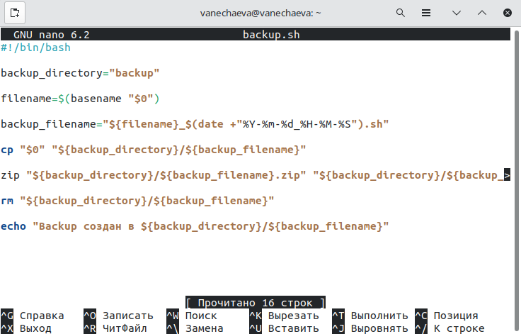
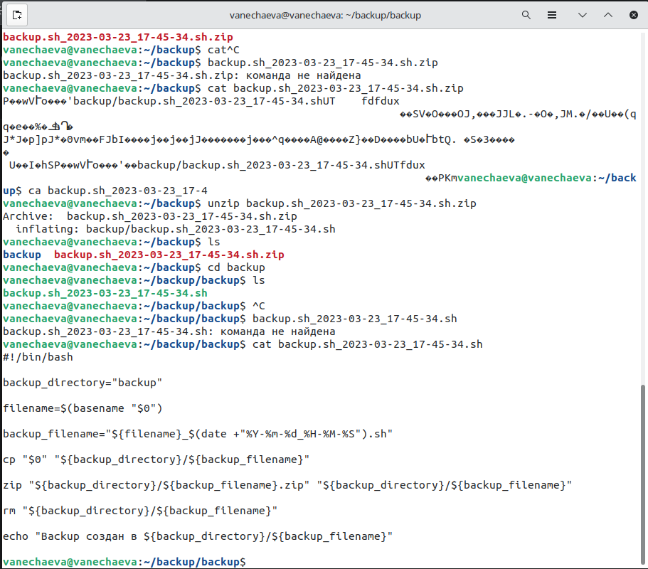
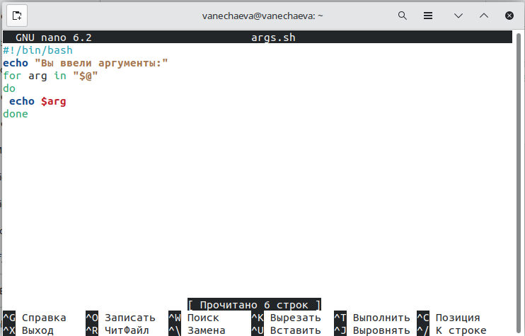
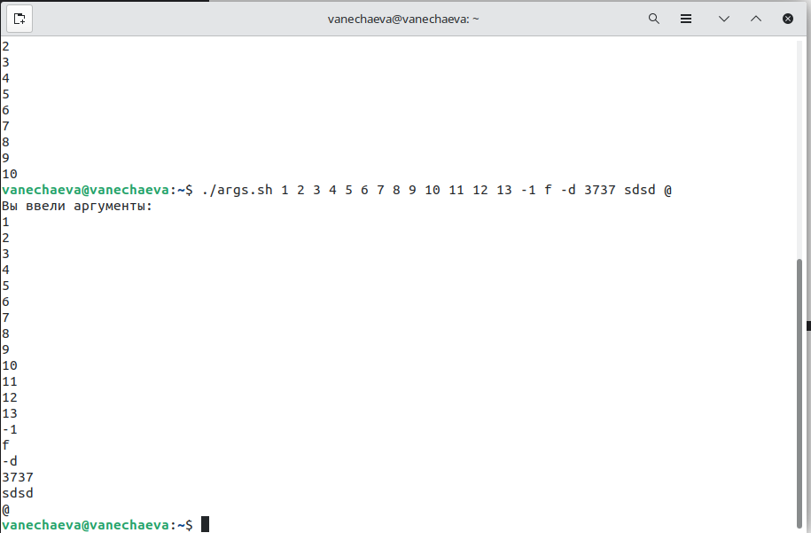
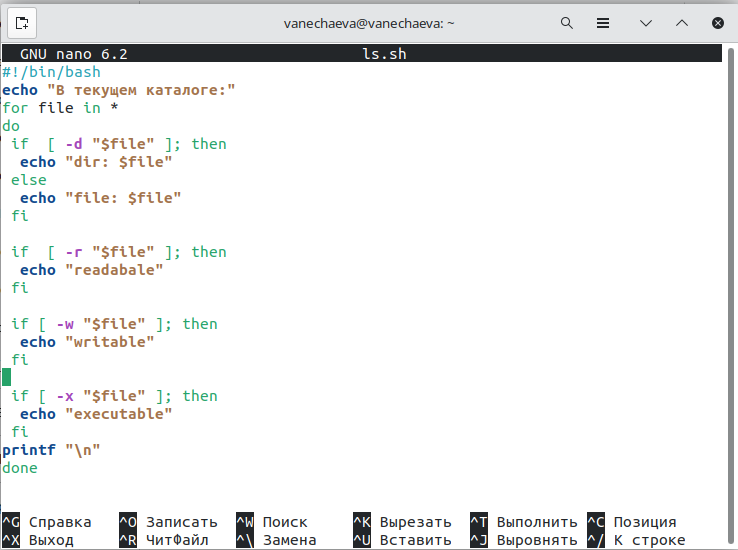
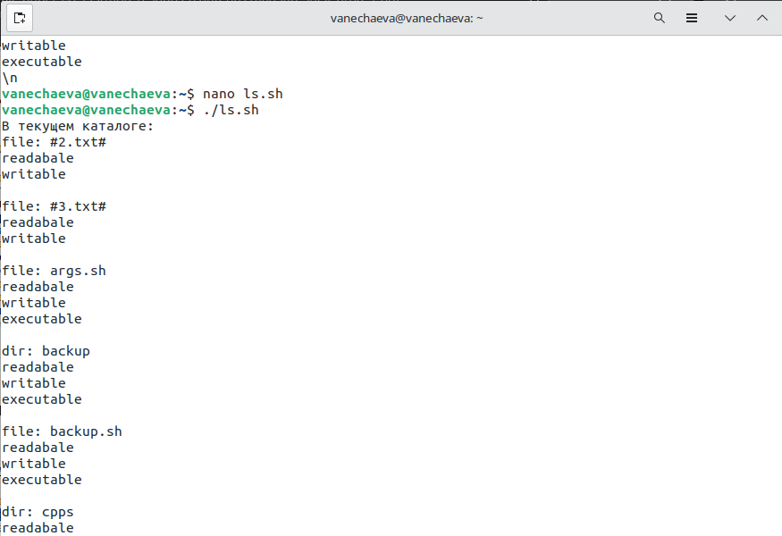
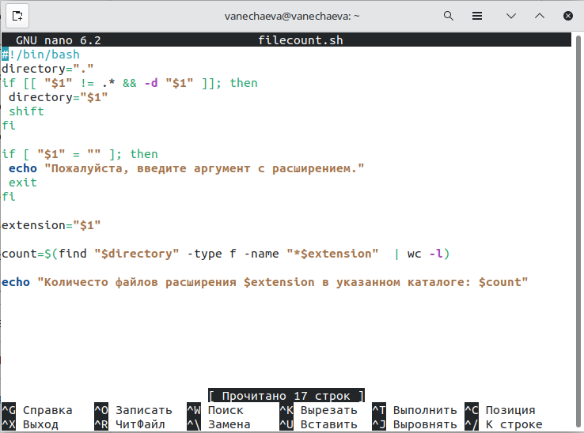
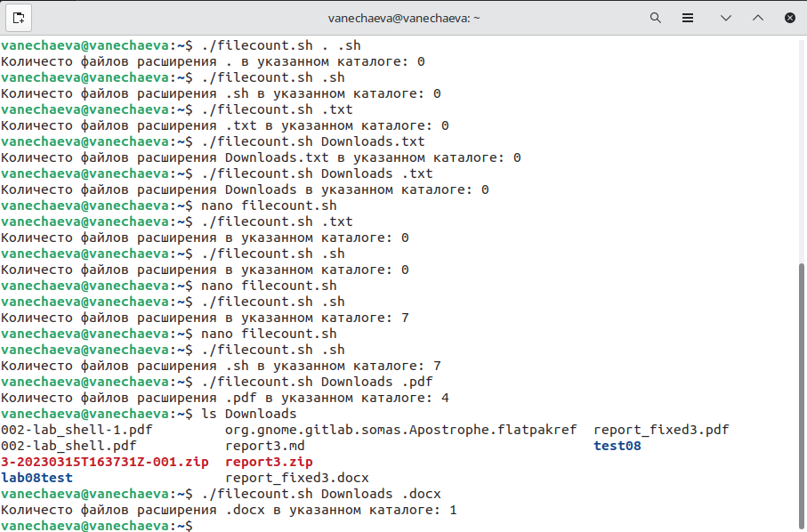

---
## Front matter
title: "Лабораторная работа №11 по предмету Операционные системы"
subtitle: "НПМбв-02-19"
author: "Нечаева Виктория Алексеевна"

## Generic otions
lang: ru-RU
toc-title: "Содержание"

## Bibliography
bibliography: bib/cite.bib
csl: pandoc/csl/gost-r-7-0-5-2008-numeric.csl

## Pdf output format
toc: true # Table of contents
toc-depth: 2
lof: true # List of figures
lot: true # List of tables
fontsize: 12pt
linestretch: 1.5
papersize: a4
documentclass: scrreprt
## I18n polyglossia
polyglossia-lang:
  name: russian
polyglossia-otherlangs:
  name: english
## I18n babel
babel-lang: russian
babel-otherlangs: english
## Fonts
mainfont: PT Serif
romanfont: PT Serif
sansfont: PT Sans
monofont: PT Mono
mainfontoptions: Ligatures=TeX
romanfontoptions: Ligatures=TeX
sansfontoptions: Ligatures=TeX,Scale=MatchLowercase
monofontoptions: Scale=MatchLowercase,Scale=0.9
## Biblatex
biblatex: true
biblio-style: "gost-numeric"
biblatexoptions:
  - parentracker=true
  - backend=biber
  - hyperref=auto
  - language=auto
  - autolang=other*
  - citestyle=gost-numeric
## Pandoc-crossref LaTeX customization
figureTitle: "Рис."
tableTitle: "Таблица"
listingTitle: "Листинг"
lofTitle: "Список иллюстраций"
lotTitle: "Список таблиц"
lolTitle: "Листинги"
## Misc options
indent: true
header-includes:
  - \usepackage{indentfirst}
  - \usepackage{float} # keep figures where there are in the text
  - \floatplacement{figure}{H} # keep figures where there are in the text
---

# Цель работы

Изучить основы программирования в оболочке ОС UNIX/Linux. Научиться писать небольшие командные файлы.

# Задание

Здесь приводится описание задания в соответствии с рекомендациями
методического пособия и выданным вариантом.

# Выполнение лабораторной работы

## Задача 1

Написать скрипт, который при запуске будет делать резервную копию самого себя (то есть файла, в котором содержится его исходный код) в другую директорию backup в вашем домашнем каталоге. При этом файл должен архивироваться одним из архиваторов на выбор zip, bzip2 или tar. Способ использования команд архивации необходимо узнать, изучив справку (рис. 1-2)

В backup_directory задается название каталога куда будет отправляться бэкап скрипта.\
В filename задается переменная с указателем $0$, ссылаясь на название текущего скрипта\
backup_filename задает название нового бэкапа, в новом названии генерируется дата и время создания\
cp в данном случае копирует текущий скрипт в backup\
zip сжимает созданный в папке backup бэкапный файл, так как сжать можно только каталог, файл автоматически кладется в папку backup\
rm удаляет backup файл, так как по заданию нужен именно архив\
echo выводит в консоль инфо о созданном бэкапе

## Задача 2

Написать пример командного файла, обрабатывающего любое произвольное число аргументов командной строки, в том числе превышающее десять. Например, скрипт может последовательно распечатывать значения всех переданных аргументов.

В коде скрипта только цикл по всем аргументам, указанным при вызове скрипта в командной строке. Выводит более 10 аргументов.

## Задача 3

Написать командный файл — аналог команды ls (без использования самой этой команды и команды dir). Требуется, чтобы он выдавал информацию о нужном каталоге и выводил информацию о возможностях доступа к файлам этого каталога.

Цикл проходит по всем файлам директории и проверяет на несколько критериев:\
Если тип это файл (-f) или каталог (-d), оно выводится в консоли. Таким образом выводятся все файлы и каталоги. Остается вывести инфо о доступах.\
В трех следующих проверках условий проверяются права доступа -r (readable), -w (writable), -x (executable), информация об этом также выводится в консоли.

## Задача 4

Написать командный файл, который получает в качестве аргумента командной строки формат файла (.txt, .doc, .jpg, .pdf и т.д.) и вычисляет количество таких файлов в указанной директории. Путь к директории также передаётся в виде аргумента командной строки.

Директория по умолчанию устанавливается текущая - "."\
В первом условии if проверяется, что первый аргумент это НЕ расширение и что первый аргумент это каталог. Если условия подходят, то переменной directory вместо значения по умолчанию присваивается каталог из первого аргумента. shift сдвигает аргумент влево, чтобы скрипт мог прочитать расширение, указанное пользователем.

Во второй проверке if проверяется условие для случая, если мы решили не указывать директорию в аргументе и указали только нужное расширение. Проверяется, что первый аргумент пустой, и в таком случае выводится сообщение о необходимости указать расширение и скрипт завершает выполнение с помощью exit.

Далее extension присвается значение первого введенного нами аргумента. count ищет с помощью find объекты типа f (файл) с названием по маске extension введенного нами, конвеер передает результат поиска функции wc которая с опцией -l считает количество строк и в последней строке через echo мы его выводим в консоли.

# Выводы

В ходе данной лабораторной работы мною были изучены основы программирования в оболочке OC UNIX/Linux.

# Контрольные вопросы

1. Объясните понятие командной оболочки. Приведите примеры командных оболочек. Чем они отличаются?

Командная оболочка — программа, через которую пользователь или администратор управляет операционной системой и установленными программами, используя командную строку. У этого понятия множество синонимов — shell, командный интерпретатор и командный процессор. Пример bash, zsh.

2. Что такое POSIX?

POSIX - это стандарт, описывающий интерфейс между операционной системой и прикладной программой

3. Как определяются переменные и массивы в языке программирования bash?

Переменная инициализруется с помощью значка доллара.

Инициализация, или объявление массивов происходит либо явно, с использованием команды declare, либо при указании массива прямо в коде. Обратите внимание на то, что если не использовать команду declare – то массив по-умолчанию будет считаться индексированным.

Примеры объявления массивов:\
	$ declare -a array\
	$ array=( [1]=one [2]=two )\
	$ echo ${array[@]}\
	one two\

4. Какие арифметические операции можно применять в языке программирования bash?

let a=5+4\
echo $a # 9\
let "a = 5 + 4"\
echo $a # 9\
let a++\
echo $a # 10\
let "a = 4 * 5"\
echo $a # 20\
let "a = $1 + 30"\
echo $a

5. Что означает операция (( ))?

В двойных скобках выполняется целочисленная арифметика.

6. Какие стандартные имена переменных Вам известны?

arg

7. Что такое метасимволы?

Метасимволом называется особая комбинация символов, которые в реальной строке могут совпадать с разными символами. Кроме того, некоторые метасимволы совпадают с границами между символами (например с началом строки). 

8. Как экранировать метасимволы?

С помощью бэкслеша

9. Как создавать и запускать командные файлы?

Создать файл filename.sh, дать права на запуск chmod +x filename.sh, запустить скрипт ./filename.sh

10. Каким образом можно выяснить, является файл каталогом или обычным файлом?

в консоли через ls\
в шелл скрипте [ -d "/path/dir/" ] && echo "Directory /path/dir/ exists"

11. Как передаются параметры в командные файлы?

При запуске скрипта указываются через пробел 

12. Назовите специальные переменные языка bash и их назначение.

`$`* – все аргументы; · $@ – все аргументы; · $# – количество аргументов; · $0 – имя скрипта; 

