---
## Front matter
title: "Лабораторная работа №12 по предмету Операционные системы"
subtitle: "Группа НПМбв-02-19"
author: "Нечаева Виктория Алексеевна"

## Generic otions
lang: ru-RU
toc-title: "Содержание"

## Bibliography
bibliography: bib/cite.bib
csl: pandoc/csl/gost-r-7-0-5-2008-numeric.csl

## Pdf output format
toc: true # Table of contents
toc-depth: 2
lof: true # List of figures
lot: true # List of tables
fontsize: 12pt
linestretch: 1.5
papersize: a4
documentclass: scrreprt
## I18n polyglossia
polyglossia-lang:
  name: russian
polyglossia-otherlangs:
  name: english
## I18n babel
babel-lang: russian
babel-otherlangs: english
## Fonts
mainfont: PT Serif
romanfont: PT Serif
sansfont: PT Sans
monofont: PT Mono
mainfontoptions: Ligatures=TeX
romanfontoptions: Ligatures=TeX
sansfontoptions: Ligatures=TeX,Scale=MatchLowercase
monofontoptions: Scale=MatchLowercase,Scale=0.9
## Biblatex
biblatex: true
biblio-style: "gost-numeric"
biblatexoptions:
  - parentracker=true
  - backend=biber
  - hyperref=auto
  - language=auto
  - autolang=other*
  - citestyle=gost-numeric
## Pandoc-crossref LaTeX customization
figureTitle: "Рис."
tableTitle: "Таблица"
listingTitle: "Листинг"
lofTitle: "Список иллюстраций"
lotTitle: "Список таблиц"
lolTitle: "Листинги"
## Misc options
indent: true
header-includes:
  - \usepackage{indentfirst}
  - \usepackage{float} # keep figures where there are in the text
  - \floatplacement{figure}{H} # keep figures where there are in the text
---

# Цель работы

Изучить основы программирования в оболочке ОС UNIX. Научится писать более сложные командные файлы с использованием логических управляющих конструкций и циклов

# Задание

1. Используя команды getopts grep, написать командный файл, который анализирует командную строку с ключами:\
– -iinputfile — прочитать данные из указанного файла;\
– -ooutputfile — вывести данные в указанный файл;\
– -pшаблон — указать шаблон для поиска;\
– -C — различать большие и малые буквы;\
– -n — выдавать номера строк.\
а затем ищет в указанном файле нужные строки, определяемые ключом -p.
2. Написать на языке Си программу, которая вводит число и определяет, является ли оно больше нуля, меньше нуля или равно нулю. Затем программа завершается с помощью функции exit(n), передавая информацию в о коде завершения в оболочку. Командный файл должен вызывать эту программу и, проанализировав с помощью команды ?, выдать сообщение о том, какое число было введено.
3. Написать командный файл, создающий указанное число файлов, пронумерованных последовательно от 1 до N (например 1.tmp, 2.tmp, 3.tmp,4.tmp и т.д.). Число файлов, которые необходимо создать, передаётся в аргументы командной строки. Этот же командный файл должен уметь удалять все созданные им файлы (если они существуют).
4. Написать командный файл, который с помощью команды tar запаковывает в архив все файлы в указанной директории. Модифицировать его так, чтобы запаковывались только те файлы, которые были изменены менее недели тому назад (использовать команду find).

# Выполнение лабораторной работы

## Задача 1

Сверху задается getops с возможными аргументами при запуске программы в терминале. Внизу в блоках if проверяется соответствие условиям и grep ищет по формату pattern подходящие строки. В последнем блоке if делается то же самое, но вывод результата происходит в файл output.txt

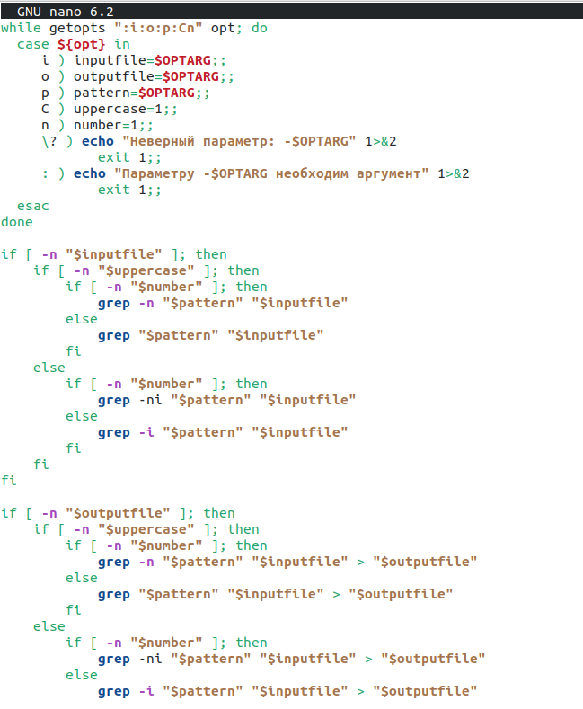

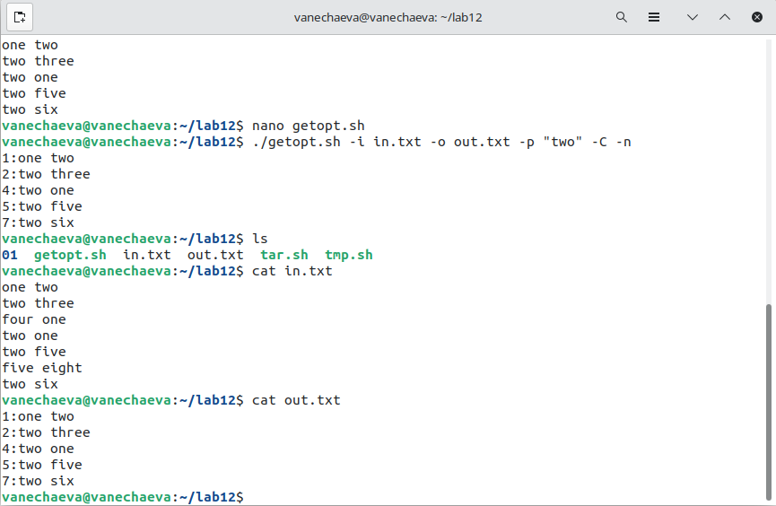

## Задача 2

Программа запрашивает ввод числа, считывает его, сравнивает согласно условиям и выводит результат. bash файл запускает программу на выполнение и echo & выводит num который мы задали в программе (берет последнее значение)

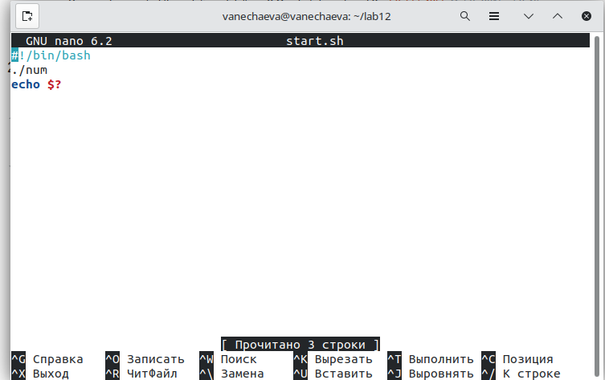

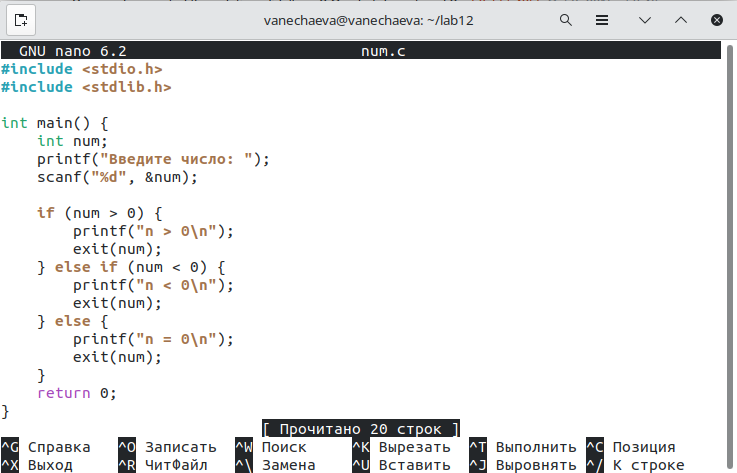

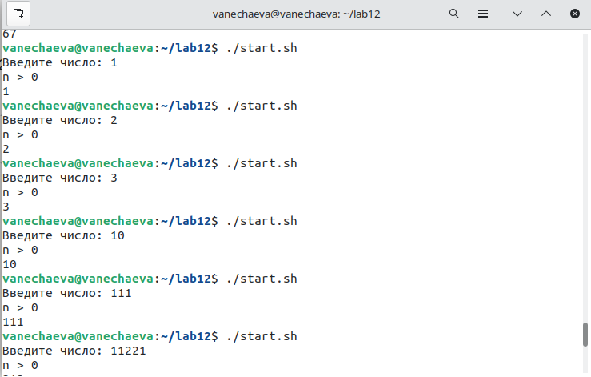

## Задача 3

В аргументе задается количество файлов, которое мы ходим создать. Цико проходит от 1 до i= 1 и создает такое количество файлов. 
Далее программа спрашивает пользователя, хочет ли он удалить созданные файлы, если пользователь отвечает "y", то только что созданные файлы удаляются в цикле по одному, если "n" (или любую другую букву), то файлы не удаляются.

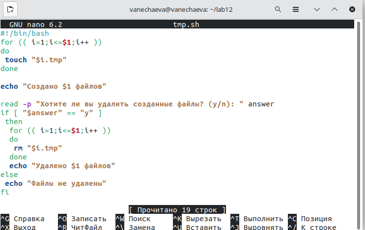

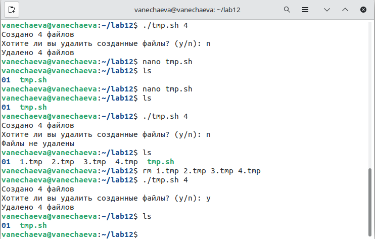

## Задача 4

Программа проверяет указан ли в строке вызова аргумент. Если нет, то программа завершается, если да, то создается .tar.gz

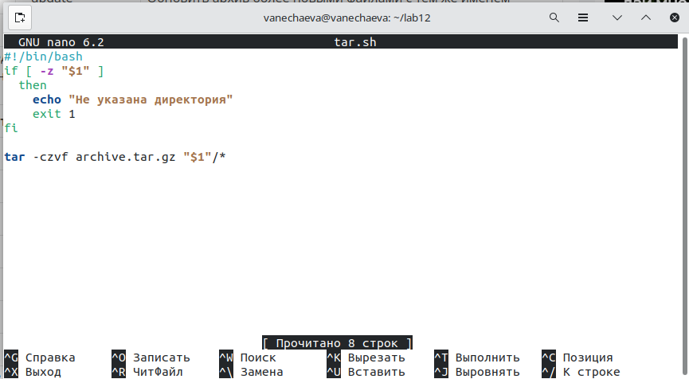

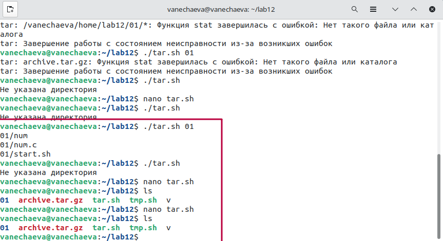

Аналогично, только еще если условие поиска по файлам, которые были изменены менее недели назад. 

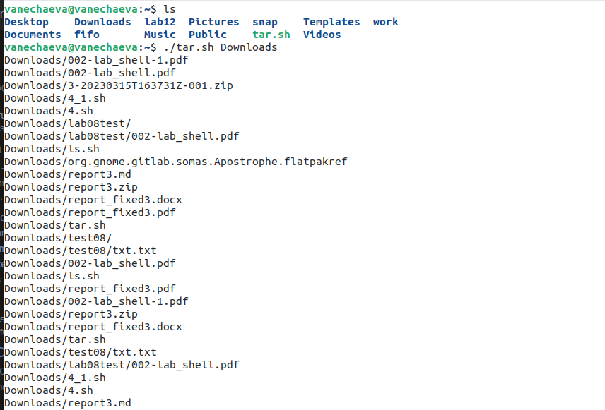

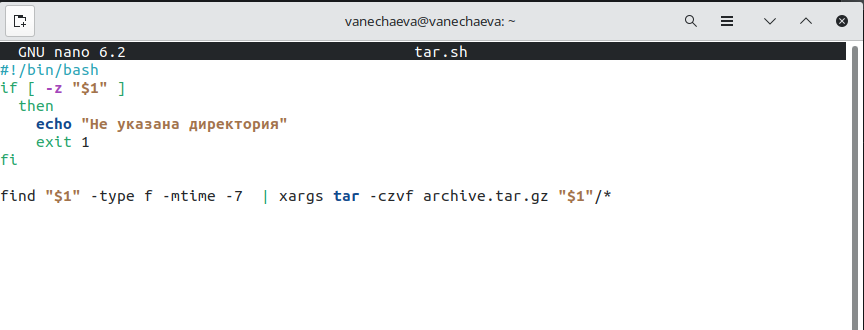

# Выводы

В ходе данной лабораторной работы мною были написаны более сложные командные файлы с использованием логических управляющих конструкций и циклов.

# Контрольные вопросы

1. Каково предназначение команды getopts?

Команда getopts в UNIX-подобных операционных системах используется для разбора аргументов командной строки. Она позволяет программистам написать скрипты, которые могут обрабатывать опции и параметры командной строки, переданные пользователем.

2. Какое отношение метасимволы имеют к генерации имён файлов?

Метасимволы в UNIX-подобных операционных системах используются для генерации имен файлов и путей к ним. Например, символ звездочки (*) соответствует любой последовательности символов в имени файла, а символ вопросительного знака (?) соответствует одному любому символу. Также метасимволы используются для выполнения поиска и замены текста в файле при использовании утилит, таких как sed и awk.

3. Какие операторы управления действиями вы знаете?

    Операторы управления действиями в UNIX-подобных операционных системах включают в себя:

    if/else: позволяет выполнить определенное действие, если условие истинно, и другое действие, если условие ложно.
    for: используется для выполнения набора команд или действий для каждого элемента в списке или диапазоне значений.
    while: выполняет определенные действия, пока условие истинно.
    case: позволяет выполнить одно действие из нескольких в зависимости от значения переменной.
    break: используется для выхода из текущего цикла.
    continue: прерывает текущую итерацию цикла и переходит к следующей.

4. Какие операторы используются для прерывания цикла?

    Для прерывания цикла в UNIX-подобных операционных системах используются следующие операторы:

    break: используется для немедленного выхода из цикла.
    continue: используется для пропуска текущей итерации цикла и перехода к следующей.

5. Для чего нужны команды false и true?

Команды false и true являются базовыми утилитами в UNIX-подобных операционных системах, которые возвращают код возврата 1 и 0 соответственно. Обычно эти команды используются в комбинации с другими командами и операторами для контроля над процессами, запускаемыми в скриптах.

6. Что означает строка if test -f man$s/$i.s, встреченная в командном файле?

Данная строка используется для проверки наличия файла в определенном месте в файловой системе. Она проверяет, существует ли файл с именем man$s/$i.$s, где $s, $i - переменные, заданные ранее в скрипте.

7. Объясните различия между конструкциями while и until

Конструкция while используется для выполнения блока кода, пока условие истинно. В то время как конструкция until используется для выполнения блока кода до тех пор, пока условие не станет истинным. Другими словами, while выполняет блок кода, пока условие не станет ложным, а until выполняет блок кода, пока условие не станет истинным.
