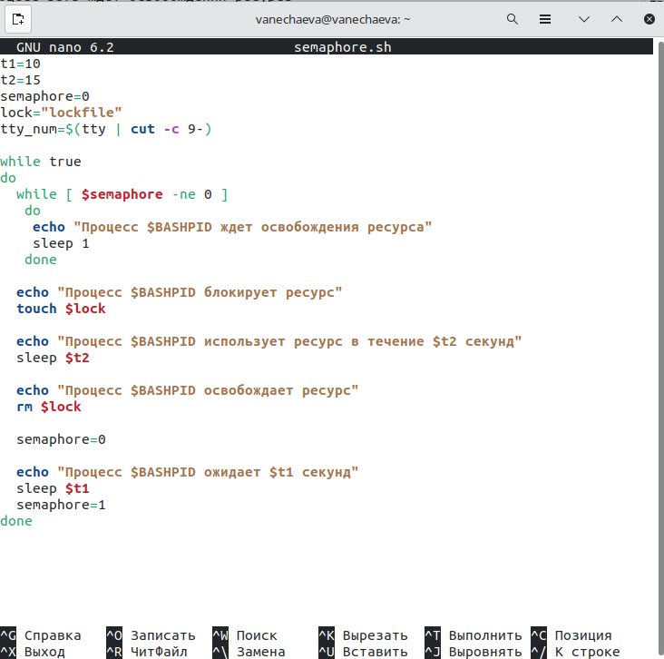
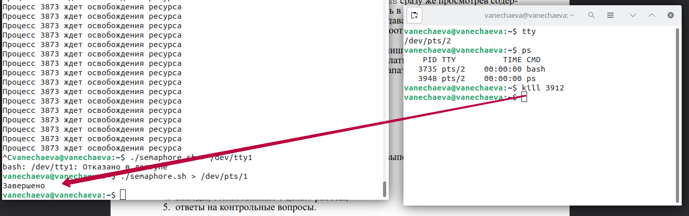
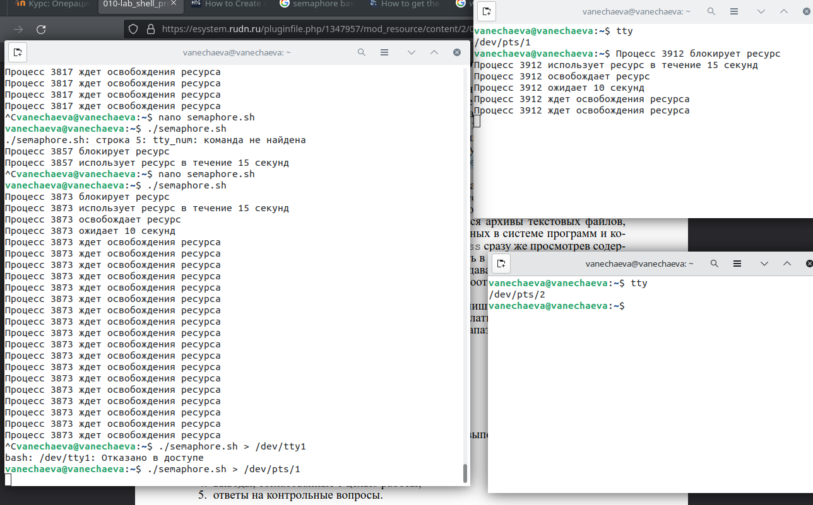
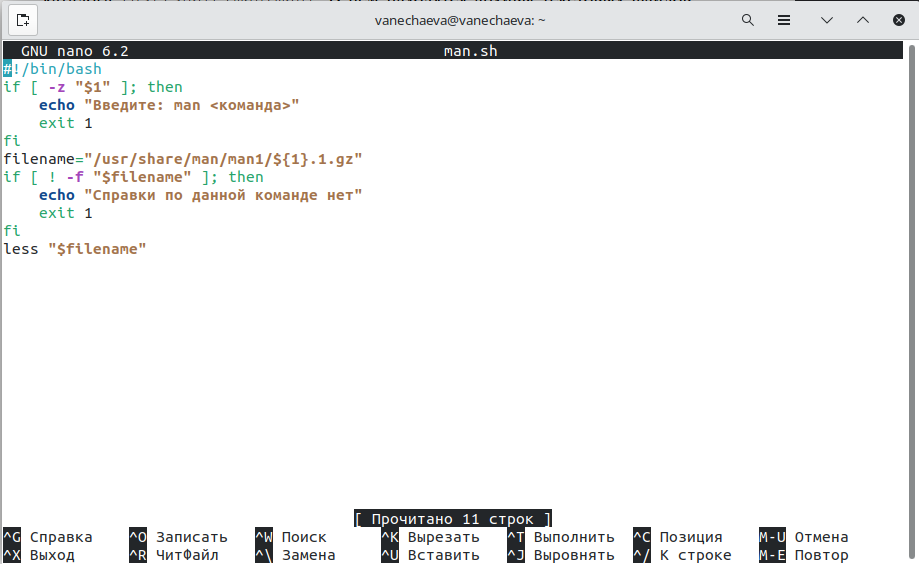
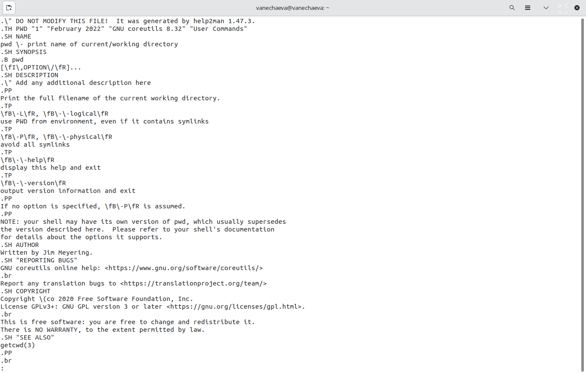
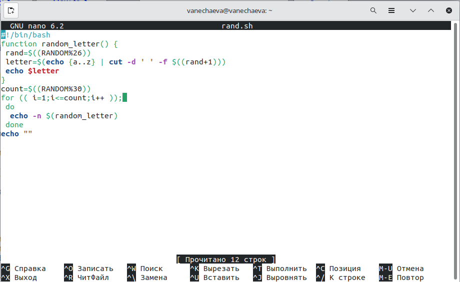
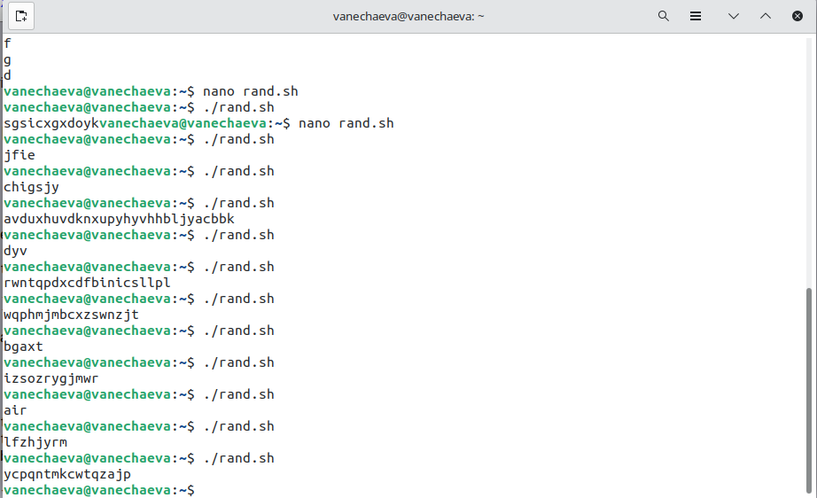

---
## Front matter
title: "Лабораторная работа №13 по предмету Операционные системы"
subtitle: "НПМбв-02-19"
author: "Нечаева Виктория Алексеевна"

## Generic otions
lang: ru-RU
toc-title: "Содержание"

## Bibliography
bibliography: bib/cite.bib
csl: pandoc/csl/gost-r-7-0-5-2008-numeric.csl

## Pdf output format
toc: true # Table of contents
toc-depth: 2
lof: true # List of figures
lot: true # List of tables
fontsize: 12pt
linestretch: 1.5
papersize: a4
documentclass: scrreprt
## I18n polyglossia
polyglossia-lang:
  name: russian
polyglossia-otherlangs:
  name: english
## I18n babel
babel-lang: russian
babel-otherlangs: english
## Fonts
mainfont: PT Serif
romanfont: PT Serif
sansfont: PT Sans
monofont: PT Mono
mainfontoptions: Ligatures=TeX
romanfontoptions: Ligatures=TeX
sansfontoptions: Ligatures=TeX,Scale=MatchLowercase
monofontoptions: Scale=MatchLowercase,Scale=0.9
## Biblatex
biblatex: true
biblio-style: "gost-numeric"
biblatexoptions:
  - parentracker=true
  - backend=biber
  - hyperref=auto
  - language=auto
  - autolang=other*
  - citestyle=gost-numeric
## Pandoc-crossref LaTeX customization
figureTitle: "Рис."
tableTitle: "Таблица"
listingTitle: "Листинг"
lofTitle: "Список иллюстраций"
lotTitle: "Список таблиц"
lolTitle: "Листинги"
## Misc options
indent: true
header-includes:
  - \usepackage{indentfirst}
  - \usepackage{float} # keep figures where there are in the text
  - \floatplacement{figure}{H} # keep figures where there are in the text
---

# Цель работы

Изучить основы программирования в оболочке ОС UNIX. Научиться писать более сложные командные файлы с использованием логических управляющих конструкций и циклов.

# Задание

1. Написать командный файл, реализующий упрощённый механизм семафоров. Командный файл должен в течение некоторого времени t1 дожидаться освобождения ресурса, выдавая об этом сообщение, а дождавшись его освобождения, использовать его в течение некоторого времени t2<>t1, также выдавая информацию о том, что ресурс используется соответствующим командным файлом (процессом). Запустить командный файл в одном виртуальном терминале в фоновом
режиме, перенаправив его вывод в другой (> /dev/tty#, где # — номер терминала куда перенаправляется вывод), в котором также запущен этот файл, но не фоновом, а в привилегированном режиме. Доработать программу так, чтобы имелась возможность взаимодействия трёх и более процессов.
2. Реализовать команду man с помощью командного файла. Изучите содержимое каталога /usr/share/man/man1. В нем находятся архивы текстовых файлов, содержащих справку по большинству установленных в системе программ и команд. Каждый архив можно открыть командой less сразу же просмотрев содержимое справки. Командный файл должен получать в виде аргумента командной строки название команды и в виде результата выдавать справку об этой команде или сообщение об отсутствии справки, если соответствующего файла нет в каталоге man1.
3. Используя встроенную переменную $RANDOM, напишите командный файл, генерирующий случайную последовательность букв латинского алфавита. Учтите, что $RANDOM выдаёт псевдослучайные числа в диапазоне от 0 до 32767.

# Выполнение лабораторной работы

## Задача 1

В качестве времени t1 задаем 10 секунд -- это время на ожидание освобождения ресурса, t2 -- время использования ресурса. Начальное значение семафора = 0.\
В цикле while процесс ждет освобождения ресурса и данный цикл прерывается каждую секунд, пока время освобождения ресурса не истечет. Далее процесс может быть заблокирован, процесс модет использовать ресурс и может быть разблокирован. Также процесс может ожидать в течение времени t2.\
Для вызова процесса в фоновом режиме использовать команду ./semaphore.sh > /dev/pts/№, где № -- номер терминала. Прервать процесс можно команды kill PID, где PID берется из фонового окна с запущенным скриптом. После прерывания программа завершает выполнение.

## Задача 2

Сначала проверяется условие, что аргумент присутствует в строке вызова скрипта. Далее значение аргумента помещается в путь переменной filename и выводится в терминале в случае, если такая команда описана. Если нет -- сообщение об этом выводится.

## Задача 3

В функции задана генерация одной случайной буквы из 26-буквенного латинского алфавита. RANDOM генерирует число от 1 до 26, letter переводит число в букву при помощи вырезания из последовательности echo{a..z} одной из букв согласно сгенерированному числу.\
В count задается случайная длина слова от 1 до 30 символов, в цикле далее согласно длине count генерируется каждая буква и в финале слово печатается в терминале.

# Выводы

В ходе данной работы  мною были изучены основы программирования в оболочке ОС UNIX и я научилась писать более сложные файлы с использованием логических управляющих конструкций и циклов.

# Контрольные вопросы

1. Найдите синтаксическую ошибку в следующей строке:
while [ $ 1 != "exit"]

Синтаксическая ошибка в данной строке заключается в том, что вместо квадратных скобок [ ] необходимо использовать круглые скобки (( )). 

2. Как объединить (конкатенация) несколько строк в одну?

Для объединения (конкатенации) нескольких строк в одну можно использовать оператор +=.

3. Найдите информацию об утилите seq. Какими иными способами можно реализовать её функционал при программировании на bash?

seq - это утилита командной строки, которая генерирует последовательность чисел. Она может использоваться для создания циклов и других задач, которые требуют генерации последовательностей чисел. Пример использования:

4. Какой результат даст вычисление выражения $((10/3))?

Результатом вычисления выражения $((10/3)) будет целое число 3. При делении целых чисел результат также является целым числом, и любая дробная часть отбрасывается.

5. Укажите кратко основные отличия командной оболочки zsh от bash.

    Некоторые отличия командной оболочки zsh от bash:

    zsh имеет более продвинутую систему автодополнения и подсказок в командной строке.
    zsh поддерживает более широкий диапазон символов при именовании файлов и переменных.
    zsh имеет более продвинутую систему расширения команд и возможности настройки.

6. Проверьте, верен ли синтаксис данной конструкции for ((a=1; a <= LIMIT; a++))

Синтаксис данной конструкции корректен, если переменная LIMIT заранее определена. Если LIMIT не определена, то при выполнении скрипта будет возникать ошибка.

7. Сравните язык bash с какими-либо языками программирования. Какие преимущества у bash по сравнению с ними? Какие недостатки?

Bash является языком командной строки, который используется для автоматизации и автоматизации выполнения задач в операционной системе Linux. В отличие от некоторых языков программирования, таких как C++ или Java, Bash имеет более простой синтаксис и специализ
