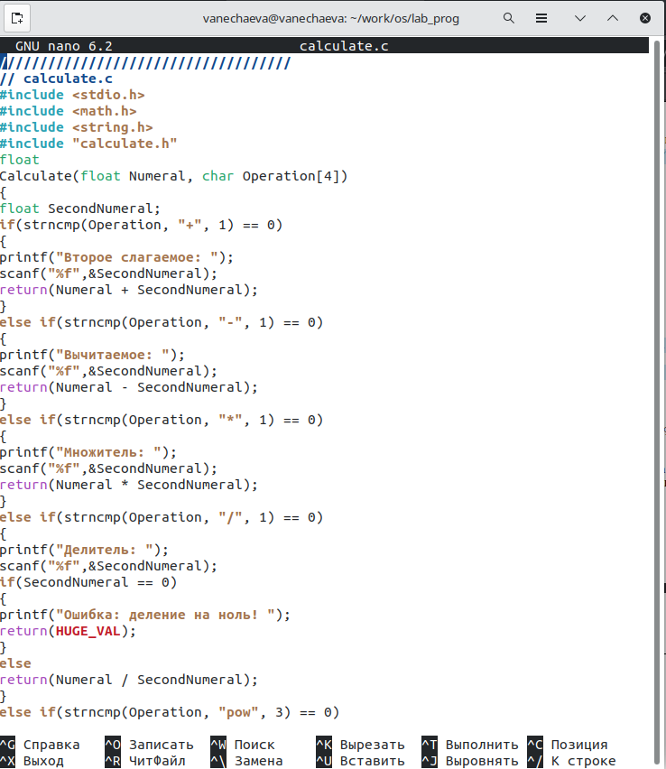
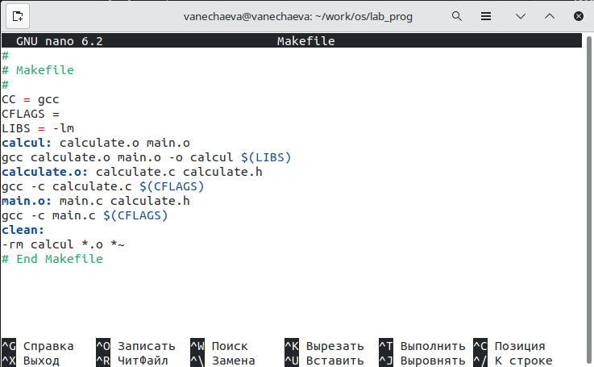

---
## Front matter
title: "Лабораторная работа №14 по предмету Операционные системы"
subtitle: "Группа НПМбв-02-19"
author: "Нечаева Виктория АЛексеевна"

## Generic otions
lang: ru-RU
toc-title: "Содержание"

## Bibliography
bibliography: bib/cite.bib
csl: pandoc/csl/gost-r-7-0-5-2008-numeric.csl

## Pdf output format
toc: true # Table of contents
toc-depth: 2
lof: true # List of figures
lot: true # List of tables
fontsize: 12pt
linestretch: 1.5
papersize: a4
documentclass: scrreprt
## I18n polyglossia
polyglossia-lang:
  name: russian
polyglossia-otherlangs:
  name: english
## I18n babel
babel-lang: russian
babel-otherlangs: english
## Fonts
mainfont: PT Serif
romanfont: PT Serif
sansfont: PT Sans
monofont: PT Mono
mainfontoptions: Ligatures=TeX
romanfontoptions: Ligatures=TeX
sansfontoptions: Ligatures=TeX,Scale=MatchLowercase
monofontoptions: Scale=MatchLowercase,Scale=0.9
## Biblatex
biblatex: true
biblio-style: "gost-numeric"
biblatexoptions:
  - parentracker=true
  - backend=biber
  - hyperref=auto
  - language=auto
  - autolang=other*
  - citestyle=gost-numeric
## Pandoc-crossref LaTeX customization
figureTitle: "Рис."
tableTitle: "Таблица"
listingTitle: "Листинг"
lofTitle: "Список иллюстраций"
lotTitle: "Список таблиц"
lolTitle: "Листинги"
## Misc options
indent: true
header-includes:
  - \usepackage{indentfirst}
  - \usepackage{float} # keep figures where there are in the text
  - \floatplacement{figure}{H} # keep figures where there are in the text
---

# Цель работы

Приобрести простейшие навыки разработки, анализа, тестирования и отладки приложений в ОС типа UNIX/Linux на примере создания на языке программирова ния С калькулятора с простейшими функциями.

# Задание

1. В домашнем каталоге создайте подкаталог ~/work/os/lab_prog.
2. Создайте в нём файлы: calculate.h, calculate.c, main.c.
Это будет примитивнейший калькулятор, способный складывать, вычитать, умножать и делить, возводить число в степень, брать квадратный корень, вычислять sin, cos, tan. При запуске он будет запрашивать первое число, операцию, второе число. После этого программа выведет результат и остановится
3. Выполните компиляцию программы посредством gcc:\
gcc -c calculate.c\
gcc -c main.c\
gcc calculate.o main.o -o calcul -lm
4. При необходимости исправьте синтаксические ошибки.
5. Создайте Makefile со следующим содержанием: Поясните в отчёте его содержание.
6. С помощью gdb выполните отладку программы calcul (перед использованием gdb исправьте Makefile):\
– Запустите отладчик GDB, загрузив в него программу для отладки:
gdb ./calcul\
– Для запуска программы внутри отладчика введите команду run:\
run\
– Для постраничного (по 9 строк) просмотра исходного код используйте команду list:\
list\
– Для просмотра строк с 12 по 15 основного файла используйте list с параметрами:\
list 12,15\
– Для просмотра определённых строк не основного файла используйте list с параметрами:\
list calculate.c:20,29\
– Установите точку останова в файле calculate.c на строке номер 21:\
list calculate.c:20,27\
break 21\
– Выведите информацию об имеющихся в проекте точка останова:\
info breakpoints\
– Запустите программу внутри отладчика и убедитесь, что программа остановится в момент прохождения точки останова:\
run\
5\
-\
backtrace\
– Отладчик выдаст следующую информацию:\
#0 Calculate (Numeral=5, Operation=0x7fffffffd280 "-") at calculate.c:21\
#1 0x0000000000400b2b in main () at main.c:17 а команда backtrace покажет весь стек вызываемых функций от начала
программы до текущего места.\
– Посмотрите, чему равно на этом этапе значение переменной Numeral, введя\
:print Numeral\
На экран должно быть выведено число 5.\
– Сравните с результатом вывода на экран после использования команды:\
display Numeral\
– Уберите точки останова:\
info breakpoints\
delete 1
7. С помощью утилиты splint попробуйте проанализировать коды файлов
calculate.c и main.c.


# Выполнение лабораторной работы

1. В домашнем каталоге создайте подкаталог ~/work/os/lab_prog.
2. Создайте в нём файлы: calculate.h, calculate.c, main.c.
Это будет примитивнейший калькулятор, способный складывать, вычитать, умножать и делить, возводить число в степень, брать квадратный корень, вычислять sin, cos, tan. При запуске он будет запрашивать первое число, операцию, второе число. После этого программа выведет результат и остановится (рис.1-3)





Выполните компиляцию программы посредством gcc:\
gcc -c calculate.c\
gcc -c main.c\
gcc calculate.o main.o -o calcul -lm


4. При необходимости исправьте синтаксические ошибки. Убираю на (рис.6) знак доллара у Operation.


5. Создайте Makefile. Поясните в отчёте его содержание.

В начале файла определяются переменные для компилятора CC (gcc в данном случае), флагов компиляции CFLAGS (которые не заданы в данном случае) и библиотеки LIBS (-lm, которая используется для математических операций).

Далее описываются правила для компиляции и линковки объектных файлов. В данном случае описывается, что для создания исполняемого файла "calcul" необходимо скомпилировать файлы calculate.c и main.c в объектные файлы calculate.o и main.o соответственно, а затем выполнить линковку этих объектных файлов с помощью команды gcc.

Также заданы правила для компиляции каждого из исходных файлов (calculate.c и main.c) в соответствующие объектные файлы.



6. С помощью gdb выполните отладку программы calcul (перед использованием gdb исправьте Makefile):\
– Запустите отладчик GDB, загрузив в него программу для отладки:
gdb ./calcul


– Для запуска программы внутри отладчика введите команду run:\
run


– Для постраничного (по 9 строк) просмотра исходного код используйте команду list:\
list


– Для просмотра строк с 12 по 15 основного файла используйте list с параметрами:\
list 12,15\
– Для просмотра определённых строк не основного файла используйте list с параметрами:\
list calculate.c:20,29\
– Установите точку останова в файле calculate.c на строке номер 21:\
list calculate.c:20,27\
break 21


– Выведите информацию об имеющихся в проекте точка останова:\
info breakpoints\
– Запустите программу внутри отладчика и убедитесь, что программа остановится в момент прохождения точки останова:\
run\
5\
-\
backtrace\
– Отладчик выдаст следующую информацию:\
#0 Calculate (Numeral=5, Operation=0x7fffffffd280 "-") at calculate.c:21\
#1 0x0000000000400b2b in main () at main.c:17 а команда backtrace покажет весь стек вызываемых функций от начала
программы до текущего места.\
– Посмотрите, чему равно на этом этапе значение переменной Numeral, введя\
:print Numeral\
На экран должно быть выведено число 5.\
– Сравните с результатом вывода на экран после использования команды:\
display Numeral\
– Уберите точки останова:\
info breakpoints\
delete 1


7. С помощью утилиты splint попробуйте проанализировать коды файлов
calculate.c и main.c.

Анализ splint рассказывает о том, где необоснованно обозначаются переменные и вполсдетвие не используются, где неверные типы, которые могут привести к неожиданным результатам. На рис.12 рассказывается, что в calculate.c игнорируются опции scanf, используется не совсем корректное сравнение с вещественным числом и используются с вещественными числами функции, которые возвращают неверный тип данных.


В main.c говорится, что в коде main.c бессмысленно использовать задачу размера Operation и что игнорируется тип возврата функции scanf.


# Выводы

В ходе лабораторной работы мною были приобретены простейшие навыки разработки, анализа, тестирования и отладки приложений в ОС UNIX на примере калькулятора, написанного на C.

# Контрольные вопросы

1. Как получить информацию о возможностях программ gcc, make, gdb и др.?

Информацию о возможностях программ gcc, make, gdb и др. можно получить, прочитав документацию по этим программам, которая обычно поставляется вместе с операционной системой или доступна в Интернете на официальных сайтах производителей. Также можно использовать команды man и info в терминале UNIX для получения справочной информации о программе.

2. Назовите и дайте краткую характеристику основным этапам разработки приложений в UNIX.

    Написание кода на языке программирования;\
    Компиляция исходного кода в исполняемый файл с помощью компилятора;\
    Отладка программы с помощью отладчика;\
    Создание файла Makefile и использование утилиты make для автоматизации процесса сборки приложения;\
    Тестирование и доработка приложения.

3. Что такое суффикс в контексте языка программирования? Приведите примеры использования.

Суффикс - это часть имени файла, которая обозначает тип файла или его формат. Например, в названии файла source.c суффикс ".c" указывает, что это файл исходного кода на языке программирования C.

4. Каково основное назначение компилятора языка С в UNIX?

Основное назначение компилятора языка С в UNIX - это компиляция исходного кода на языке С в исполняемый файл, который можно запустить в операционной системе UNIX.

5. Для чего предназначена утилита make?

Утилита make предназначена для автоматизации процесса сборки приложения в UNIX. Она использует файл Makefile, который содержит инструкции по сборке приложения, и автоматически выполняет необходимые действия для компиляции исходного кода и создания исполняемого файла.

6. Приведите пример структуры Makefile. Дайте характеристику основным элементам этого файла.

```
CC = gcc
CFLAGS = -Wall -g

app: main.o utils.o
    $(CC) $(CFLAGS) -o app main.o utils.o

main.o: main.c
    $(CC) $(CFLAGS) -c main.c

utils.o: utils.c
    $(CC) $(CFLAGS) -c utils.c
```

Основными элементами этого файла являются переменные (например, CC и CFLAGS), цели (например, app) и правила сборки (например, app: main.o utils.o).

7. Назовите основное свойство, присущее всем программам отладки. Что необходимо сделать, чтобы его можно было использовать?

Основное свойство, присущее всем программам отладки - это возможность управления выполнением программы, остановки ее на определенном месте, просмотра значений переменных и выполнения команд в контексте отладки. Чтобы использовать эту функциональность, необходимо иметь доступ к исходному коду программы.

8. Назовите и дайте основную характеристику основным командам отладчика gdb.

    Основные команды отладчика gdb:

    break: установка точки останова на определенной строке или функции
    run: запуск программы\
    next: выполнение текущей строки кода без захода внутрь функции\
    step: выполнение текущей строки кода с заходом внутрь функции\
    print: вывод значения переменной\
    watch: установка точки останова на изменении значения переменной\
    backtrace: вывод стека вызовов функций

9. Опишите по шагам схему отладки программы, которую Вы использовали при выполнении лабораторной работы.

Скомпилировать программу с опцией -c.\
Создать Makefile.\
Запустить отладчик gdb, указав имя скомпилированного исполняемого файла\
Запустить программу run\
Посмотреть исходный код list\
Установить точки останова на нужных строках кода с помощью команды break\
Запустить программу с помощью команды run\
После нахождения ошибки исправить код программы и повторить процесс отладки

10. Прокомментируйте реакцию компилятора на синтаксические ошибки в программе при его первом запуске.

Компилятор при первом запуске анализирует код программы на предмет синтаксических ошибок. Если он находит ошибку, он выводит сообщение об ошибке, которое может включать номер строки и тип ошибки. Это помогает разработчику быстро находить и исправлять ошибки в коде программы.

11. Назовите основные средства, повышающие понимание исходного кода программы.

    Комментарии в коде, которые объясняют, что делает код и как он работает\
    Отладочные сообщения, которые выводят информацию о состоянии программы в различных точках ее выполнения\
    Документация к программе, которая описывает ее функциональность и интерфейс

12. Каковы основные задачи, решаемые программой splint?

    Поиск ошибок в коде программы, таких как неинициализированные переменные, использование нулевых указателей, переполнение буфера и других\
    Анализ стиля кодирования, включая соответствие стандартам программирования и принятых практикам\
    Поиск потенциальных уязвимостей в безопасности программы, таких как уязвимости, связанные с памятью и неправильным использованием строковых функций.
