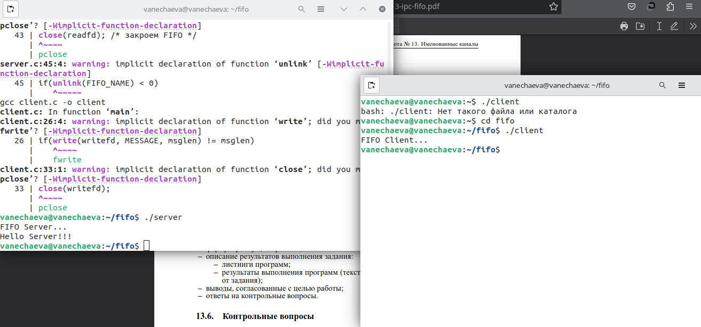
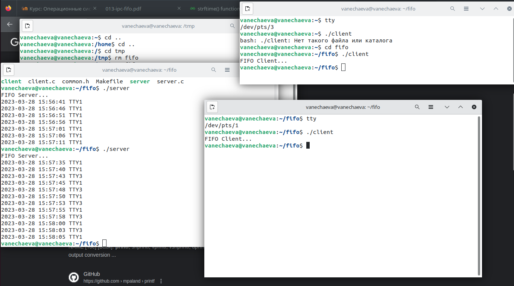
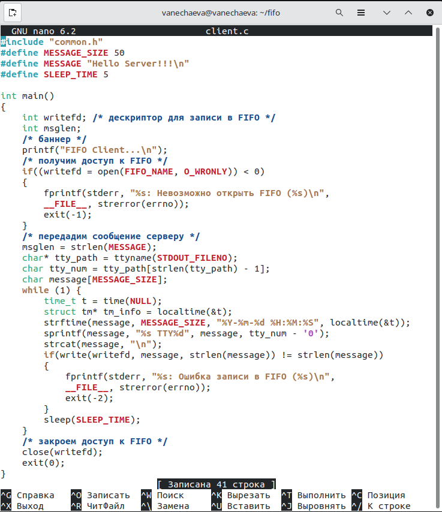
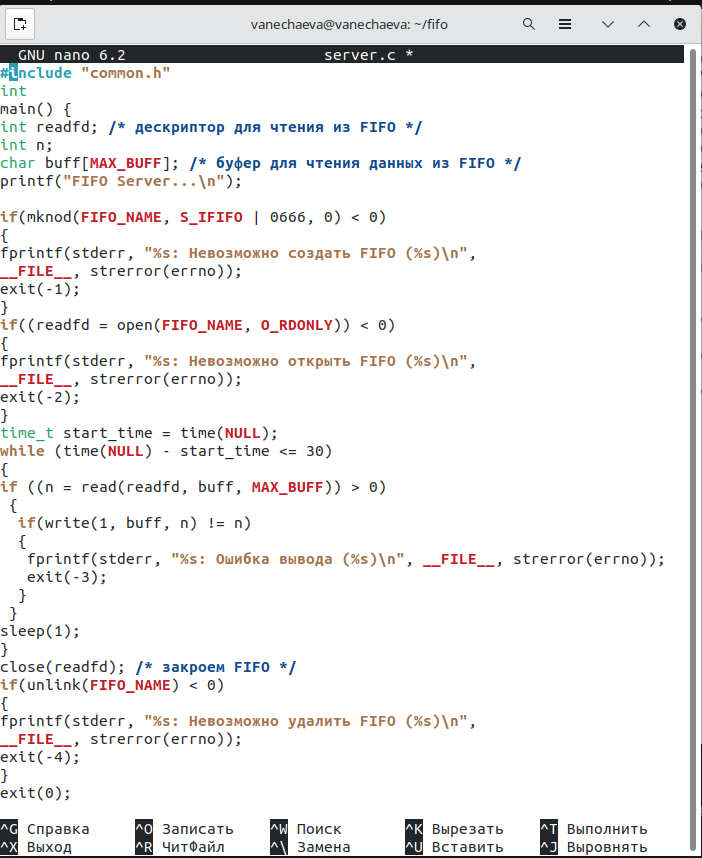
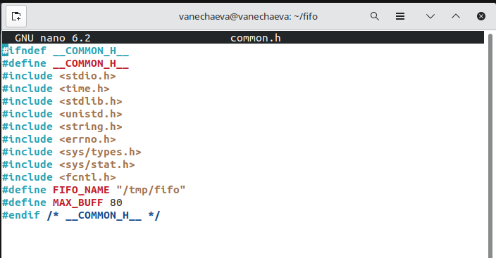
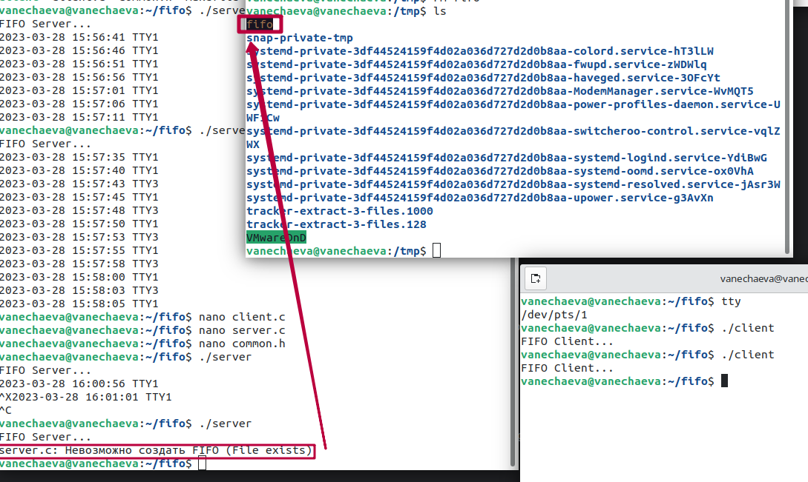

---
## Front matter
title: "Лабораторная работа №15 по предмету Операционные системы"
subtitle: "Группа НПМбв-02-19"
author: "Нечаева Виктория Алексеевна"

## Generic otions
lang: ru-RU
toc-title: "Содержание"

## Bibliography
bibliography: bib/cite.bib
csl: pandoc/csl/gost-r-7-0-5-2008-numeric.csl

## Pdf output format
toc: true # Table of contents
toc-depth: 2
lof: true # List of figures
lot: true # List of tables
fontsize: 12pt
linestretch: 1.5
papersize: a4
documentclass: scrreprt
## I18n polyglossia
polyglossia-lang:
  name: russian
polyglossia-otherlangs:
  name: english
## I18n babel
babel-lang: russian
babel-otherlangs: english
## Fonts
mainfont: PT Serif
romanfont: PT Serif
sansfont: PT Sans
monofont: PT Mono
mainfontoptions: Ligatures=TeX
romanfontoptions: Ligatures=TeX
sansfontoptions: Ligatures=TeX,Scale=MatchLowercase
monofontoptions: Scale=MatchLowercase,Scale=0.9
## Biblatex
biblatex: true
biblio-style: "gost-numeric"
biblatexoptions:
  - parentracker=true
  - backend=biber
  - hyperref=auto
  - language=auto
  - autolang=other*
  - citestyle=gost-numeric
## Pandoc-crossref LaTeX customization
figureTitle: "Рис."
tableTitle: "Таблица"
listingTitle: "Листинг"
lofTitle: "Список иллюстраций"
lotTitle: "Список таблиц"
lolTitle: "Листинги"
## Misc options
indent: true
header-includes:
  - \usepackage{indentfirst}
  - \usepackage{float} # keep figures where there are in the text
  - \floatplacement{figure}{H} # keep figures where there are in the text
---

# Цель работы

Приобретение практических навыков работы с именованными каналами.

# Задание

Изучите приведённые в тексте программы server.c и client.c. Взяв данные примеры за образец, напишите аналогичные программы, внеся следующие изменения:\
1. Работает не 1 клиент, а несколько (например, два).\
2. Клиенты передают текущее время с некоторой периодичностью (например, раз в пять секунд). Используйте функцию sleep() для приостановки работы клиента.\
3. Сервер работает не бесконечно, а прекращает работу через некоторое время (например, 30 сек). Используйте функцию clock() для определения времени работы сервера. Что будет в случае, если сервер завершит работу, не закрыв канал?

# Выполнение лабораторной работы
 
Ниже -- как работает версия из лабораторной работы.

Как работает версия с требованиями из задания (рис.2)

На скринкасте в действии работа fifo на 43-ей минуте.\
Канал открыт на 30 секунд, запущены два клиента, каждый из них каждые 5 секунд отчитывается о работе серверу. По истечении канал закрывается и по очереди клиенты завершают работу - сначала тот, который пришел последним, потом первый.

В client.c добавлены SLEEP_TIME = 5 и MESSAGE_SIZE = 50, добавлен бесконечный цикл while оканчивающийся с закрытием сервера. В цикле определяется локальное время для выведения по каналу времени, чтобы было понятно, что клиенты обмениваются информацией по каналу каждые 5 секунд. С помощью tty_path и tty_num узнаем номер клиента (терминала) (рис.3)

В server.c задано время работы сервера -- 30 секунд, в цикле while(time(NULL)...) (рис.4)

В common.h добавлены <unistd.h> и <time.h> (рис.5)

Если в терминале прервать исполнение server, то в каталоге /tmp останется файл пайпа fifo, наличие которого мешает вновь запустить сервер. Поэтому его надо удалить руками (рис.6)

# Выводы

В ходе лабораторной работы мною были приобретены практические навыки работы с именованными каналами.

# Контрольные вопросы

1. В чем ключевое отличие именованных каналов от неименованных?

Именованные каналы (FIFO) существуют в файловой системе и могут использоваться для обмена данными между процессами, как между связанными процессами, так и между несвязанными процессами. Неименованные каналы (pipe) используются только для обмена данными между связанными процессами и существуют только в пределах одного процесса.

2. Возможно ли создание неименованного канала из командной строки?

Создание неименованного канала из командной строки не предусмотрено, т.к. это требует выполнения нескольких системных вызовов и настройки прав доступа.

3. Возможно ли создание именованного канала из командной строки?

Да, создание именованного канала из командной строки возможно (mknod)

4. Опишите функцию языка С, создающую неименованный канал.

Для создания неименованного канала в языке С используется функция pipe(). Она принимает в качестве аргумента массив из двух целочисленных дескрипторов файлов: pipefd[0] для чтения из канала и pipefd[1] для записи в канал. Функция возвращает 0 в случае успешного выполнения и -1 в случае ошибки.

5. Опишите функцию языка С, создающую именованный канал.

Для создания именованного канала в языке С используется функция mkfifo(). Она принимает в качестве аргумента путь к создаваемому каналу и права доступа (mode). Функция возвращает 0 в случае успешного выполнения и -1 в случае ошибки.

6. Что будет в случае прочтения из fifo меньшего числа байтов, чем находится в канале? Большего числа байтов?

Если при чтении из FIFO меньше байтов, чем есть в канале, то процесс блокируется до тех пор, пока в канале не появятся новые данные. Если при чтении больше байтов, чем есть в канале, то процесс блокируется до тех пор, пока другой процесс не запишет новые данные в канал.

7. Аналогично, что будет в случае записи в fifo меньшего числа байтов, чем позволяет буфер? Большего числа байтов?

Если при записи в FIFO меньше байтов, чем позволяет буфер, то данные записываются в буфер частично. Если при записи больше байтов, чем позволяет буфер, то процесс блокируется до тех пор, пока другой процесс не прочтет часть данных из канала и не освободит место в буфере.

8. Могут ли два и более процессов читать или записывать в канал?

Два и более процессов могут читать и записывать в канал. При этом каждый процесс будет иметь свой собственный дескриптор канала, который будет использоваться для чтения или записи данных.

9. Опишите функцию write (тип возвращаемого значения, аргументы и логику работы). Что означает 1 (единица) в вызове этой функции в программе server.c (строка 42)?

Функция write() используется для записи данных в файловый дескриптор. Она принимает три аргумента: дескриптор файла, указатель на буфер, содержащий данные, и количество байтов, которые нужно записать. Функция возвращает количество записанных байтов в случае успешного выполнения и -1 в случае ошибки.

В программе server.c (строка 42) значение 1 в вызове функции write() означает, что нужно записать в канал 1 байт из буфера buffer.

10. Опишите функцию strerror.

strerror() используется для получения строки с описанием ошибки, связанной с кодом ошибки errno. Она принимает в качестве аргумента код ошибки и возвращает строку с описанием ошибки, если такое описание есть в системе. Если описание ошибки не найдено, функция возвращает строку "Unknown error".
